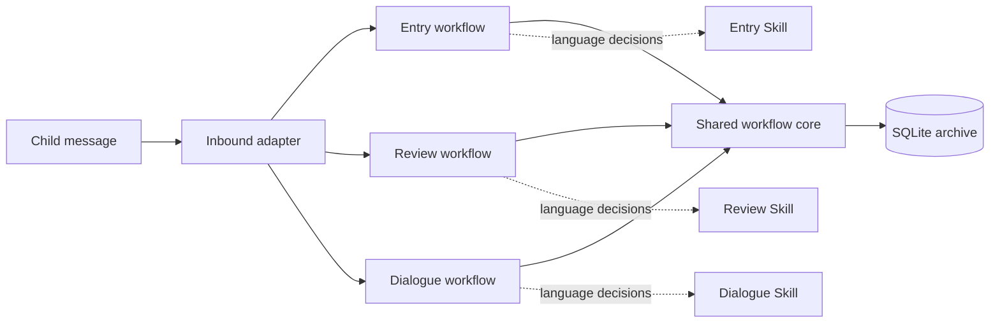

# Dada Study Review

MIT-licensed reference implementation for a controlled English learning workflow.

Dada separates deterministic learning-record management from language judgment. Program code owns workflow state, learning records, frozen review queues, question locks, scheduling, recovery, and bounded persistence. State-machine Skills handle English review, question wording, semantic assessment, Dialogue turns, and child-facing feedback through versioned JSON contracts.

This public repository contains reusable code and sanitized examples. It is not a hosted service or a ready-to-run children's application.

## What It Provides

- **Entry workflow** for recording, reviewing, and independently archiving English learning material.
- **Review workflow** with frozen due-item queues, one locked question at a time, semantic assessment, versioned scheduling, and recovery after interruption.
- **Textbook-constrained Dialogue** with immutable Unit packages, frozen round steps, target progress, retryable question intents, and Review-batch handoff.
- **Course-maintenance Skills** for converting textbook screenshots into page-split Markdown and validated Dialogue-Unit candidates.
- **Provider-neutral TTS boundary** with bounded MP3 output and a text fallback.
- **Generic OpenClaw inbound adapter source** with static-session authorization and explicit production composition boundaries.
- **Deterministic verification** using temporary SQLite databases, synthetic scopes, fake gateways, and Node replay tests.

## Architecture



The runtime is intentionally split into bounded layers:

1. The inbound adapter authorizes a static session and selects the active workflow.
2. The production composition layer injects a fixed, versioned model definition and transport.
3. LangGraph coordinates controlled transitions and recovery.
4. The shared workflow core persists business facts and enforces revisions, locks, schedules, and queue ownership.
5. Skills return structured language decisions; they do not access SQLite or mutate learning records.

See [Architecture](docs/ARCHITECTURE.md) and [Module Design](docs/MODULE_DESIGN.md) for the detailed module boundaries, contracts, and recovery model.

## Workflow Model

### Entry

Entry records a child-provided English line as material, asks the configured Skill to review and segment it, and stores the resulting learning items. Items that can be activated automatically are independent of items requiring additional information. Material requiring explicit parent approval remains a draft and never enters the review queue.

### Review

When review starts, the program freezes all due learning items for that workflow. It advances through that queue one item at a time; the model cannot select, skip, or reorder items. The question text, visible response, assessment, and state transition are committed under the workflow's persistence rules. If a child leaves before answering the locked question, the item is neither graded nor rescheduled and can appear again later.

The default consolidation schedule is versioned and program-owned:

```text
1 hour -> 3 hours -> 5 days -> 30 days -> archive
```

The model supplies a structured assessment. The program validates it and applies the configured policy. Historical schedule records retain the policy version that produced them.

### Dialogue

Dialogue loads a validated Unit package and freezes a bounded round plan. The model conducts the English conversation within the current scenario and step, while the program records progress, target mastery evidence, and retryable question intents. Stable `target_id` values preserve mastery identity across Unit package versions. A successful Dialogue round may create a dedicated Review batch, but it does not silently start Review.

## Course Content Pipeline

The public course-maintenance flow is:

```text
textbook screenshots
  -> page-split English Markdown
  -> Unit candidate
  -> task audit and semantic review
  -> candidate validation
  -> immutable Unit JSON
  -> Dialogue targets and question intents
```

Textbook images, private course workspaces, generated candidates, formal archives, identities, credentials, and delivery targets are intentionally excluded from this repository. Provide course inputs from a separate local workspace and review any generated course data before publication.

## Quick Start

Requirements:

- Python 3.12+
- Node.js 22.12+ (including `node:sqlite`)
- pnpm 9+
- Bash, Git Bash, or WSL

The workspace is defined by `config/workspace.json`; start from `config/workspace.example.json`. It owns the virtual environment, Node dependencies, course inputs, archive, logs, temporary files, and generated outputs. External deployment targets are configured separately and are not part of the workspace.

```bash
./scripts/bootstrap-workspace.sh
pnpm run test:offline
```

The offline suite uses temporary data, synthetic scope values, and fake gateways. It does not contact model providers, TTS providers, OpenClaw Gateway, messaging channels, or a real learning archive.

## Initialize a SQLite Archive

After installing the dependencies, initialize a new archive with:

```bash
./scripts/initialize-database.py
```

The command resolves the default archive path from the workspace configuration. An explicit path can be supplied when needed:

```bash
./scripts/initialize-database.py --database /path/to/workflow-v3.sqlite3
```

Initialization is idempotent. It creates or verifies the Dada business tables and LangGraph checkpoint tables, then runs SQLite integrity checks. It does not import learning material, create a child identity, migrate a legacy archive, delete data, or read credentials.

## Verification

Run the offline Python and Node gates independently or together:

```bash
pnpm run test:python
pnpm run test:node
pnpm run test:offline
```

The Node gate includes inbound authorization, route behavior, Review replay, and JavaScript syntax checks. The Python gate exercises the controlled repository and workflow contracts with temporary data.

## Project Layout

```text
config/                         Non-secret workspace and runtime policies
data/                           Runtime learning archives (not published)
runtime/
  v3_workflow/                  Shared SQLite schema, repository, and scheduling
  v3_entry/                     Entry graph, contracts, and gateway ports
  v3_review/                    Review graph, contracts, and gateway ports
  v3_dialogue/                  Dialogue graph, Unit loader, and contracts
  *_production/                 Fixed definitions and transport composition
  inbound_v3_workflow_hook/     OpenClaw inbound routing adapter
skill/                          Entry, Review, Dialogue, and course-maintenance Skills
scripts/                        Workspace, archive, publication, and test entry points
tests/                          Offline contract, graph, gateway, and replay tests
docs/                           Architecture, module, and database references
```

The SQLite schema and transaction boundaries are documented in [Database Schema](docs/DATABASE_SCHEMA.md). The public tree's implementation details are indexed by [Module Design](docs/MODULE_DESIGN.md).

## Optional Integrations

The repository includes anonymous configuration examples for static child scope, OpenClaw routing, and optional TTS. Copy examples outside the repository, replace every example value, and keep credentials in a protected secret store.

The OpenClaw adapter is source code only. A real deployment must supply deployment-owned session mapping, archive paths, model transport, definition digests, and protected credentials. This repository provides no production deployment command and never supplies those values.

## Boundaries and Security

This project is not:

- a hosted service;
- a shared archive platform;
- a production messaging-bot deployment;
- a model-weights distribution; or
- proof that a live provider, Gateway, Feishu/WeChat channel, or learning archive is enabled.

Do not commit learning archives, session identifiers, API keys, cookies, delivery targets, textbook images, private course workspaces, or model request/response logs. The runtime keeps credentials out of SQLite events and checkpoint state, but operators remain responsible for host security, backups, transport security, and access control.

## License

This project is licensed under the [MIT License](LICENSE). See [CONTRIBUTING.md](CONTRIBUTING.md) and [SECURITY.md](SECURITY.md) for contribution and security guidance.
