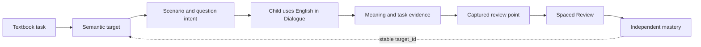
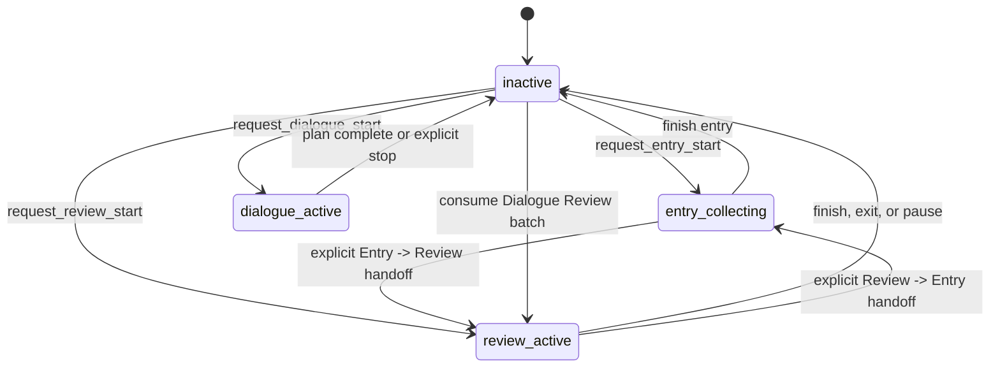

# Dada Study Review

MIT-licensed reference implementation for a controlled English learning workflow.

Dada is designed for a family that wants textbook-based English practice to become a repeatable learning loop: capture what the child needs to learn, use it in a meaningful situation, evaluate the meaning of the response, review it at the right time, and preserve the evidence. Deterministic program code owns workflow state, learning records, frozen review queues, question locks, scheduling, recovery, and bounded persistence. State-machine Skills handle English review, question wording, semantic assessment, Dialogue turns, and child-facing feedback through versioned JSON contracts.

This public repository contains reusable code and sanitized examples. It is not a hosted service, a ready-to-run children's application, or proof of a live provider or messaging deployment.

## Why This Product Exists

Traditional vocabulary review and general-purpose chat each solve only part of the learning problem:

- A word list can test recognition but does not show whether a child can use the language in a situation.
- A textbook contains rich tasks, roles, questions, and information relationships, but those structures are easy to lose when converted into ad-hoc chat prompts.
- A generic LLM can produce fluent conversation, but it may skip learning points, judge answers inconsistently, repeat questions, or claim that a workflow has started when it has not.
- A child may leave halfway through a task. Without durable state, the next session cannot tell whether a question was answered, whether it was graded, or what should happen next.
- Audio makes practice more natural, but a failed TTS request must not erase a committed answer or alter the learning schedule.

Dada addresses these problems by making the learning loop explicit and by giving every part of the loop a clear owner.

## Product First Principles

### 1. Learning is demonstrated use, not text storage

The smallest useful learning unit is an observable meaning or communication ability that a child can use in context. A target may be a `word`, `phrase`, `sentence`, or `function`. A target is not automatically complete because the child has seen it or repeated a string; the system evaluates whether the child answered the current question or completed the intended communication task.

### 2. Language judgment and business facts have different owners

The program is responsible for facts that must be deterministic: which workflow is active, which Unit and step are frozen, which item is due, which question is locked, whether a revision matches, and which schedule is applied. The Skill is responsible for language judgment: how to ask a question, whether the answer carries the intended meaning, what needs correction, and how to encourage the child. The Skill cannot access SQLite, select queue items, change state, schedule a review, or archive data.

### 3. Every learning point needs a traceable path

Published content should be explainable from textbook page to teaching task, target, scenario, question intent, child evidence, and later review item. The system therefore keeps source references, semantic focus, evidence type, content slots, target identity, and audit events rather than treating a prompt as the whole curriculum.

### 4. Commit first, then deliver

A visible reply or audio attachment is not the source of truth. The program commits the business fact and the response that belongs to it first; delivery happens afterward. Recovery re-sends committed content instead of calling the model again, inventing a new question, or changing the score.

### 5. Progress belongs to the child and target, not to a package version

Unit package versions freeze the content used by one workflow. Stable `target_id` values preserve a child's mastery identity across package versions. A new display arrangement or review configuration must not reset existing mastery, while genuinely new content receives a new identity.

### 6. Optional infrastructure must fail safely

TTS, an LLM provider, OpenClaw, and messaging channels are adapters around the learning core. A provider failure may produce a fixed unavailable response or text fallback, but it must not create false success, mutate a score, skip a queue item, or write credentials into business state.

## Who It Helps

Dada is useful for:

- **Families** that want a private, textbook-aligned practice loop instead of an opaque chatbot.
- **Parents or teachers** who need to see what was practiced, what was understood independently, and what requires another review.
- **Engineers building agentic learning tools** who need a concrete example of separating model judgment from durable workflow facts.
- **Teams evaluating LLM workflows** that need versioned contracts, deterministic replay, synthetic test data, and explicit failure boundaries.

It is not intended for public multi-tenant hosting, unrestricted free conversation, automatic grading by string similarity, or unsupervised production deployment.

## The Learning Loop



The loop is deliberately closed: content is not considered ready merely because a model generated a question, and a review point is not created merely because a child produced an incomplete or off-topic answer.

## How to Enter Dialogue Content

Dialogue content is maintained as a controlled course pipeline rather than typed directly into a production prompt.

### Step 1: Transcribe textbook screenshots

Provide an explicit local course workspace containing the Unit images. Use `$dada-textbook-screenshot-to-markdown` to:

1. inspect every candidate image at a readable resolution;
2. confirm the printed textbook page number and page boundary;
3. create one English Markdown file per printed page under `<unit>/english-text/page-<number>.md`;
4. create or update `<unit>/english-text/README.md` as an ascending page index; and
5. record uncertainty instead of guessing unreadable text, page numbers, tables, or symbols.

The screenshot Skill preserves headings, exercise numbers, dialogue speakers, question wording, tables, examples, captions, and footnotes. It does not create targets, scenarios, meanings, question intents, archives, or production configuration.

### Step 2: Build a Unit candidate

Supply the `unit_id`, title, version, and allowed source pages, then use `$dada-textbook-markdown-to-unit-candidate`. The candidate workflow:

1. reads only the Unit index and allowed page files;
2. inventories what each page asks the learner to do, including information dimensions such as time, place, people, quantity, comparison, or reason;
3. maps every learner task to a target, scenario content slot, or explicit exclusion reason;
4. chooses a target type (`word`, `phrase`, `sentence`, or `function`) from the required semantics rather than from word frequency;
5. creates source references, semantic focus, child output requirements, scenarios, and at least one question intent per target;
6. validates deduplication and bidirectional references; and
7. writes a candidate plus task-audit and semantic-review sidecars before finalization.

The final Unit is immutable for its version. A different reasonable design is a new candidate version, not an in-place edit.

### Step 3: Validate and finalize

The candidate is checked with:

```bash
python scripts/validate-dialogue-unit-candidate.py \
  --candidate config/dialogue-units/<unit-id>/unit.v<version>.candidate.json \
  --english-text <unit>/english-text \
  --unit-id <unit-id> \
  --version <version> \
  --source-pages 14,15 \
  --task-audit config/dialogue-units/<unit-id>/unit.v<version>.candidate.task-audit.json \
  --semantic-review config/dialogue-units/<unit-id>/unit.v<version>.candidate.semantic-review.json

python scripts/finalize-dialogue-unit-candidate.py \
  --candidate config/dialogue-units/<unit-id>/unit.v<version>.candidate.json \
  --english-text <unit>/english-text \
  --unit-id <unit-id> \
  --version <version> \
  --source-pages 14,15 \
  --task-audit config/dialogue-units/<unit-id>/unit.v<version>.candidate.task-audit.json \
  --semantic-review config/dialogue-units/<unit-id>/unit.v<version>.candidate.semantic-review.json \
  --output config/dialogue-units/<unit-id>/unit.v<version>.json
```

The exact command options are defined by the scripts in the checked-out tree. Finalization must fail if a same-version Unit already exists; it never overwrites a frozen package.

## How Dialogue Points Become Review Points

A Dialogue target and a Review point are related but not identical:

1. The program freezes a Unit, scenario, target, question intent, difficulty, and current step for the Dialogue turn.
2. The Skill returns a versioned JSON evaluation. It can report `exposed`, `supported_success`, `independent_success`, or `unable`, plus grammar observations and a bounded repetition outcome.
3. The program validates every returned target ID against the frozen Unit. The Skill cannot invent a target or select a different queue.
4. `capture_candidate_target_ids` is used only under the Dialogue contract. A partial L4 answer may create a pending repetition set; a successful repetition may capture that exact set. L2/L3 answers and ordinary `unable` turns do not create candidates.
5. The repository deduplicates and persists eligible target content as learning items with review context. Capture is not performed when the child fails to repeat the complete required meaning.
6. When the Dialogue round closes, captured items are placed into one ordered `dialogue_review_batch`. Closing Dialogue does not silently start Review.
7. The next explicit Review start consumes at most one unconsumed batch for that child scope and freezes its queue. Review then applies its own question lock, assessment, and schedule rules.

`independent_success` records that the child independently demonstrated the stable target and is not scheduled again by default. `supported_success` can complete the current Dialogue step while leaving the target retryable. A function target can guide communication but is not itself a reviewable vocabulary item; reviewable `word`, `phrase`, and `sentence` targets carry the bounded review design needed for later practice.

## How Dialogue Is Designed

Dialogue is continuous, scenario-bound practice rather than a series of disconnected quizzes.

- A Unit contains targets, scenarios, question intents, source pages, and completion rules.
- The program creates a frozen round plan of no more than 12 content steps from the child's persisted mastery facts.
- Every round starts at L2. The program may progress through L2 guided questions, L3 role play, and L4 reasoned responses.
- L4 can require multiple content slots in one answer, such as an activity and a reason or a place and a time.
- `understand_and_respond` tests a complete answer; `semantic_expression` tests natural expression around a meaning; `initiate_question` supplies a role, purpose, and information gap; `interaction` completes a communication action in role.
- The main question must explicitly elicit the current focus target. The Skill may not switch to a neighboring topic, choose another target, or reorder the frozen plan.
- A complete answer is judged by meaning before grammatical perfection. Minor grammar, spelling, case, or preposition errors that do not change meaning do not force repetition.
- A correction that affects the target or obscures meaning explains the issue in Chinese, gives the correct English, reads it, and asks for repetition. The target remains incomplete until the required meaning is repeated.
- The child can end by clearly asking to stop. The Skill only requests `stop_dialogue`; the program decides whether the round can close and whether a Review batch is created.

This design preserves the difference between exposure, supported practice, independent use, and later spaced review.

## How the States Connect

There is one active workflow per child scope. The host's idle intent layer may request a fixed start action, but active messages are handled by the corresponding state machine.



The important transitions are controlled by the program:

| State or transition | Program owns | Skill owns |
| --- | --- | --- |
| `inactive` | Static authorization, due reminder, and fixed start actions | Intent classification only when no workflow is active |
| `entry_collecting` | Workflow, material, audit events, draft/active lifecycle, and readiness | English review, segmentation, clarification, and feedback wording |
| `dialogue_active` | Frozen Unit/round plan, target identity, step, progress, capture, and close | English turn, semantic evaluation, correction, and transition request |
| `review_active` | Due-item selection, frozen queue, locked question, revision, assessment persistence, schedule, and archive | Question wording, answer semantics, accuracy, error words, and feedback |
| Entry → Review | Revalidates readiness and atomically creates the first locked question | Supplies the prospective first-question language decision |
| Dialogue → Review | Closes Dialogue and creates or consumes a dedicated ordered batch | Supplies bounded capture candidates; never starts Review directly |

If a workflow fails before its transition is committed, the old state remains authoritative. If the child exits while a Review question is locked, the question is retained without grading or rescheduling.

## TTS Interface

TTS is an optional outbound adapter shared by Review and Dialogue. It is disabled by default and is never required by the core or offline CI.

### Provider-neutral contract

The interface lives in `runtime/v3_workflow/tts/`:

```python
class TtsProvider(Protocol):
    def synthesize_mp3(config: TtsConfig, text: str, open_request) -> bytes: ...

def synthesize_tts_delivery(
    config: TtsConfig,
    text: str | None,
    outbox: Path,
) -> Path | None: ...
```

The delivery service validates non-empty text, enforces maximum text and audio sizes, prunes expired MP3 files, writes a new file with restricted permissions, and returns a safe media path. The key is read only by the narrow production composition layer, never by the workflow core.

### Supported adapters and configuration

The shared environment family is `DADA_REVIEW_TTS_*`. The public adapters currently support:

- `volcengine_seed`: resource `seed-tts-2.0` and a configured speaker;
- `minimax`: endpoint `https://api.minimaxi.com/v1/t2a_v2`, model `speech-2.8-turbo`, and a configured voice ID.

Every deployment fixes the endpoint, timeout, `maxTextChars`, `maxAudioBytes`, and `retentionSeconds`. A local TTS gateway may be integrated only through the fixed `POST /v1/speech` contract returning bounded MP3 bytes; arbitrary endpoints, headers, and file paths are not accepted.

### What gets spoken

- Review uses the committed response plus the locked `speech_text` for spelling and sentence-recall modes.
- Dialogue speaks the committed model response, including Chinese correction guidance, English demonstrations, or repetition instructions.
- Program-owned state labels, queue counts, and progress text remain a separate visible channel and are not hidden inside Dialogue TTS.

Use the explicit public smoke test with a privacy-free sentence:

```bash
scripts/run-tts-smoke.py \
  --provider minimax \
  --config <path> \
  --text "Hello. This is a public TTS smoke test."
```

Replace `minimax` with `volcengine_seed` when using that adapter. The smoke test writes no learning archive. If TTS fails, the already committed text is delivered instead; the system does not re-call the model, re-grade the answer, re-schedule the item, or advance the queue.

## Quick Start

Requirements:

- Python 3.12+
- Node.js 22.12+ (including `node:sqlite`)
- pnpm 9+
- Bash, Git Bash, or WSL

The workspace is defined by `config/workspace.json`; start from `config/workspace.example.json`. It owns the virtual environment, Node dependencies, course inputs, archive, logs, temporary files, and generated outputs. External deployment targets are configured separately and are not part of the workspace.

```bash
./scripts/bootstrap-workspace.sh
pnpm run test:offline
```

The offline suite uses temporary data, synthetic scope values, and fake gateways. It does not contact model providers, TTS providers, OpenClaw Gateway, messaging channels, or a real learning archive.

## Initialize a SQLite Archive

After installing the dependencies, initialize a new archive with:

```bash
./scripts/initialize-database.py
```

The command resolves the default archive path from the workspace configuration. An explicit path can be supplied when needed:

```bash
./scripts/initialize-database.py --database /path/to/workflow-v3.sqlite3
```

Initialization is idempotent. It creates or verifies the Dada business tables and LangGraph checkpoint tables, then runs SQLite integrity checks. It does not import learning material, create a child identity, migrate a legacy archive, delete data, or read credentials.

## Verification

Run the offline Python and Node gates independently or together:

```bash
pnpm run test:python
pnpm run test:node
pnpm run test:offline
```

The Node gate includes inbound authorization, route behavior, Review replay, and JavaScript syntax checks. The Python gate exercises the controlled repository and workflow contracts with temporary data.

## Project Layout

```text
config/                         Non-secret workspace and runtime policies
data/                           Runtime learning archives (not published)
runtime/
  v3_workflow/                  Shared SQLite schema, repository, scheduling, and TTS
  v3_entry/                     Entry graph, contracts, and gateway ports
  v3_review/                    Review graph, contracts, and gateway ports
  v3_dialogue/                  Dialogue graph, Unit loader, and contracts
  *_production/                 Fixed definitions and transport composition
  inbound_v3_workflow_hook/     OpenClaw inbound routing adapter
skill/                          Entry, Review, Dialogue, and course-maintenance Skills
scripts/                        Workspace, archive, publication, and test entry points
tests/                          Offline contract, graph, gateway, and replay tests
docs/                           Architecture, module, and database references
```

The SQLite schema and transaction boundaries are documented in [Database Schema](docs/DATABASE_SCHEMA.md). The implementation relationships are indexed by [Module Design](docs/MODULE_DESIGN.md), and the design rationale is in [Architecture](docs/ARCHITECTURE.md).

## Optional Integrations

The repository includes anonymous configuration examples for static child scope, OpenClaw routing, and optional TTS. Copy examples outside the repository, replace every example value, and keep credentials in a protected secret store.

The OpenClaw adapter is source code only. A real deployment must supply deployment-owned session mapping, archive paths, model transport, definition digests, and protected credentials. This repository provides no production deployment command and never supplies those values.

## Boundaries and Security

This project is not:

- a hosted service;
- a shared archive platform;
- a production messaging-bot deployment;
- a model-weights distribution; or
- proof that a live provider, Gateway, Feishu/WeChat channel, or learning archive is enabled.

Do not commit learning archives, session identifiers, API keys, cookies, delivery targets, textbook images, private course workspaces, or model request/response logs. The runtime keeps credentials out of SQLite events and checkpoint state, but operators remain responsible for host security, backups, transport security, and access control.

## License

This project is licensed under the [MIT License](LICENSE). See [CONTRIBUTING.md](CONTRIBUTING.md) and [SECURITY.md](SECURITY.md) for contribution and security guidance.
