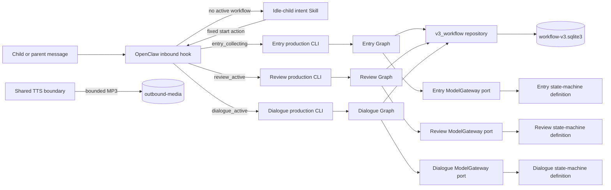
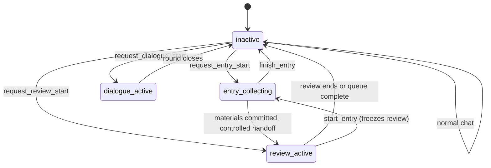

# Dada Study Review — Architecture

| Project | Content |
| --- | --- |
| Type | Architecture explanation |
| Status | Reference implementation; offline core, production composition and inbound adapter implemented; live enablement requires separate authorization |
| Target reader | Maintainers, architecture reviewers, integrators |
| Source of truth | `runtime/`, `skill/`, `config/`, `scripts/`, `tests/` |
| Last reviewed | 2026-09-07 |

## 1. Conclusion

Dada Study Review is a development agent and reference implementation for building controlled English-material review workflows. It productizes one end-to-end loop:

```text
material intake            textbook screenshots -> page-split Markdown,
                           or direct Markdown input
  -> content extraction    themed Units, targets, scenarios, question intents
       -> review           due-item review and Dialogue practice: frozen queues,
                           locked questions, assessment, versioned scheduling
            -> interaction  the child talks through an agent host (the OpenClaw
                            inbound plugin, or any other host) that routes each
                            message to the active workflow
```

At runtime it is a single-family, single-process English recitation system with three controlled workflows: **Entry** (recording and auditing new English material), **Review** (frozen due-item queues, question locks, semantic assessment and versioned scheduling), and **Dialogue** (textbook-constrained English conversation over immutable Unit packages). Deterministic program code owns all business facts — workflow state, learning records, frozen queues, question locks, scheduling, recovery and bounded persistence. State-machine LLMs own only language decisions — English review, question wording, answer assessment, Dialogue turns and child-facing feedback — through fixed, versioned JSON contracts.

The system is deliberately split into an outer **inbound adapter**, **production composition layers**, per-workflow **LangGraph state machines**, a shared **workflow repository**, and a single **SQLite learning archive**. Each boundary is narrow: the LLM never touches SQL, state transitions, scheduling or outbound delivery; the program never scores English. The course-content half of the loop (screenshots to Unit packages) runs through two offline maintenance Skills and produces immutable, validated content — it never touches the runtime archive.

## 2. Design principles

| Principle | Meaning |
| --- | --- |
| Program/LLM separation | Code owns state, permissions, transactions, queues, scheduling, archival and recovery. LLMs own English judgment and child-facing wording only. |
| One shared archive | Entry, Review and Dialogue share `workflow-v3.sqlite3`, isolated logically by `external_session_id`. No second archive root. |
| Frozen review queues | A review start freezes every due item for the session at that moment. The program advances one item at a time; the LLM cannot select, skip or re-queue. |
| Commit-then-deliver | A question and its visible reply are committed in one transaction before anything is sent. Recovery re-sends only committed facts, never regenerates. |
| Static identity, minimal permission | Identity comes from a fixed session mapping. No generic `exec`, arbitrary file access, browser automation or dynamic identity inference. |
| Skill as the only edit source | `skill/` defines LLM behavior; `runtime/*_production/` assembles fixed definitions, digests and transports. A Skill change requires explicit publish and digest synchronization. |
| Provider-neutral boundaries | Model Gateway ports and the TTS boundary carry no provider SDK or credentials into core packages. |
| Offline-first verification | Deterministic Python/Node tests use temporary SQLite, synthetic scopes and fake gateways. Live providers, channels and archives are explicit opt-in. |

## 3. Why state machines

The decision to make Entry, Review and Dialogue LangGraph state machines — instead of prompt-guided agents — is the project's central architectural choice.

### 3.1 The failure that motivated it

Version 1 delegated entry, auditing, review and tool orchestration to a free-form chat Skill. A real observation of one entry session showed: the model saved the source text but did not reliably emit per-item audit results, and it tried to end entry while material was still pending. The defect was not "the model ignored more prose rules"; it was that the **loop, coverage and termination conditions had been delegated to a probabilistic model**.

Version 3 moves deterministic control flow back into Python, LangGraph and SQLite. LangGraph defines nodes and transitions in code; the Skill is a constrained task definition for the LLM; the adapter is a program boundary that turns a validated model result into fixed business actions; the repository is the only layer allowed to read and write the learning archive.

### 3.2 Why each property must be code, not prompt

| Property | Because |
| --- | --- |
| Control flow cannot be guaranteed by prompts | Entry and Review are mutually exclusive state machines; the LLM cannot directly transition state or write the archive. |
| Persistent business facts must be recoverable | A shared SQLite database, short transactions, an immutable event log and minimal checkpoints separately hold business facts and execution-recovery state. |
| Model output must be validated before it acts | Versioned contracts constrain model output; the adapter validates before performing fixed actions. |
| What the child sees must be explainable | Review questions, locks and visible replies are committed before delivery; recovery re-sends only committed text. |
| Model suggestions cannot modify business rules | The LLM returns an assessment (answer judgment); the program applies a versioned scheduling policy. |

### 3.3 The transferable judgment

Whenever an LLM output would change a long-lived business record and the flow has ordering, coverage, permission, retry, audit or delivery constraints, those constraints belong in code. One-shot question answering or side-effect-free text rewriting does not need a workflow structure. This is what makes the framework portable beyond English recitation — the same boundary applies to ticket systems, approvals, document intake or incident response, where the LLM drafts and judges but the program owns state, permissions and delivery.

## 4. System context



The hook performs exact static-session authorization and routes by the current activity fact read from SQLite. Active messages go straight to a production CLI — they never pass through the idle-child chat Skill. Inactive messages reach the child intent Skill, which may only call the fixed zero-parameter start actions (`dada_repetition_archive`). A separate daily parent-report CLI exists in the private deployment but is not part of this repository's child-facing request path.

## 5. Layers and responsibilities

| Layer | Owns | Never |
| --- | --- | --- |
| Inbound hook (`runtime/inbound_v3_workflow_hook/`) | Static session/conversation authorization, activity query, fixed routing, visible outbound, TTS media delivery | English judgment, arbitrary SQL, dynamic identity |
| Production composition (`runtime/*_production/`) | Fixed definition bundle + digest, transport, environment wiring, TTS attachment, stdin/stdout JSON boundary | Business judgment, generic model selection, credential persistence |
| Graph (`runtime/v3_entry|v3_review|v3_dialogue/graph/`) | Node recovery, contract validation, controlled transitions, commit ordering | Provider creation, arbitrary archive access |
| `v3_workflow` repository | SQLite tables, immutable event log, queues, schedule policy, fixed repository actions | LangGraph, OpenClaw, LLM judgment |
| Skill LLM (`skill/`) | English review, question wording, assessment, Dialogue turns, child wording, transition requests | SQL, state, scheduling, permissions, sending |

## 6. Runtime module map

```text
runtime/
  v3_workflow/                  Shared SQLite schema, repository, schedule policy,
                                model-turn pipeline, TTS boundary, event contracts
  v3_entry/                     Entry Graph, contracts, ModelGateway port
  v3_review/                    Review Graph, contracts, question-mode selection,
                                Entry→Review handoff
  v3_dialogue/                  Dialogue Graph, Unit loader, round planning,
                                contracts, Gateway port
  v3_entry_production/          Fixed Entry definition bundle, CLI, real transport
  v3_review_production/         Fixed Review definition bundle, CLI, TTS wiring
  v3_dialogue_production/       Fixed Dialogue definition bundle, CLI
  inbound_v3_workflow_hook/     OpenClaw inbound plugin (index.mjs)
```

The core packages import no provider SDK and hold no credentials. Credentials reach only the narrow production transport constructed by each production CLI from environment variables.

## 7. Data model (SQLite)

The archive is a single SQLite database; LangGraph uses separate checkpoint tables. All business tables live under `runtime/v3_workflow/persistence/schema.py`.

| Table | Responsibility | Key constraints |
| --- | --- | --- |
| `workflows` | Current Entry/Review/Dialogue snapshot | One active per session; a Review workflow always references a learning item; phase in `active`/`paused_for_entry`/`closed` |
| `workflow_log_events` | Ordered, immutable system/child/LLM/assistant events | Increasing `sequence_no` per workflow; refs only to earlier same-workflow events |
| `learning_materials` | Material lifecycle and audit result | `draft`/`active`/`archived`/`superseded`; `needs_parent_review` flag |
| `learning_items` | Smallest review unit with independent progress | `review_stage`, `next_review_at`, `completed_at`, `revision`; optional frozen `review_context_json` |
| `review_queue_items` | One frozen review queue | Queue position, item revision at start, status `pending`/`locked`/`completed` |
| `dialogue_workflow_state` | Current Dialogue position | Unit identity frozen (`unit_id`, `unit_version`, `unit_content_hash`), current scenario/target, difficulty 0–4, subphase |
| `dialogue_round_plans` | One frozen round plan | Plan JSON, current step index, content-turn count ≤ 12, status |
| `dialogue_review_batches` | Learning items produced by a closed Dialogue round | Consumed by exactly one Review workflow |
| `dialogue_review_batch_items` | Items in a dialogue review batch | Unique per batch |

Two partial unique indexes enforce the activity model: `one_active_workflow_per_session` and `one_paused_review_per_session`.

Events are typed and versioned through `dada.workflow_log_event v1`. Common types include `child_message`, `llm_request`, `llm_response`, `assistant_response`, `state_transition`, `model_turn_attempt_failed`; Review adds `question_locked`, `question_released`, `schedule_applied`, `material_archived`; Dialogue adds `dialogue_turn_evaluated`, `dialogue_capture_committed`, `dialogue_round_planned`, `dialogue_progress_checkpoint`, `dialogue_round_completed`, `dialogue_target_reopened`, among others.

## 8. Versioned contracts

Every model exchange uses a fixed task name and version. The LLM receives only the minimal frozen context and returns one structured result.

| Contract | Version | Role |
| --- | --- | --- |
| `dada.workflow_log_event` | v1 | Unified event envelope |
| `dada.entry_state_machine_turn` | v1 | Entry Graph fixed input |
| `dada.entry_state_machine_result` | v3 | Entry production output |
| `dada.entry_audit` | v3 | Entry archive submission (inside result) |
| `dada.review_state_machine_turn` | v5 | Review Graph fixed input |
| `dada.review_state_machine_result` | v4 | Review production output |
| `dada.review_assessment` | v1 | Scheduling input (inside result) |
| `dada.dialogue_state_machine_turn` | v1 | Dialogue Graph fixed input |
| `dada.dialogue_state_machine_result` | v1 | Dialogue production output |

Core consumers read multiple older result versions for migration; the live provider accepts the current version only. Note that the machine-turn version and the result-envelope version are independent version spaces (for example Review turn is v5 while its result contract is v4).

## 9. Workflows

### 9.1 Activity states



Only `entry_collecting`, `review_active` and `dialogue_active` are real runtime states; no active workflow is the inactive condition, not a fourth state. Entry, Review and Dialogue never overlap.

### 9.2 Entry workflow

Registered nodes in `runtime/v3_entry/graph/nodes.py`: `entry_route` → (`entry_process_turn` | `entry_closing` | `entry_recover`), terminating in the `entry_waiting_for_child` or `entry_terminal` state. The Entry→Review switch is not a Graph node: it runs inside the model-turn adapter commit (see 9.5).

- **start**: `request_entry_start` creates a workflow; the model returns a `reply_only` greeting and asks for English one line at a time.
- **collect_message**: each line is audited through `dada.entry_state_machine_turn v1`. Correct material produces `record_entry_audit`; the program validates and creates materials/items/re-entry requests in one transaction. Ordinary omissions produce a specific `reentry_requests` item instead of blocking the correct material.
- **parent review**: only content whose intended meaning, fixed textbook wording or proper name still cannot be determined after clarification is marked `needs_parent_review=true` and stays `draft` until an approved parent action promotes it to `active`. `draft` never enters a review queue.
- **finish**: `finish_entry` closes the workflow when re-entry and handoff conditions are met.
- **switch**: `requested_transition=start_review` is only a request; the Graph decides after checking re-entry, due items and handoff conditions (see 9.5).

### 9.3 Review workflow

Registered nodes in `runtime/v3_review/graph/nodes.py`: `review_route` → (`review_starting` | `review_process_answer` | `review_next_question`) → (`review_waiting_for_child` | `review_terminal`), with `review_recover` for recovery.

- **freeze**: a start picks every due item for the session and writes `review_queue_items`. The queue is frozen for the round.
- **question modes**: the program selects only an exercise mode within a fixed pool — `word`: `spelling`, `zh_to_en`, `en_to_zh`; `phrase`: `zh_to_en`; `sentence`: `sentence_recall`, `zh_to_en`, `en_to_zh` — balanced across the workflow and avoiding immediate repeats.
- **lock**: the question, its `assistant_response`, the queue progression and the checkpoint are committed in one transaction before the child sees anything. A later inbound call re-sends only the committed text.
- **answer**: the child's answer is assessed through `dada.review_state_machine_turn v5`. An unrelated message keeps the locked question and re-delivers it without grading.
- **assessment**: `complete_assessment` carries `dada.review_assessment v1` (accuracy, explanation, incorrect words, feedback basis). The program validates it and applies the schedule policy (section 10); the LLM cannot set stages, intervals or due times.
- **exit**: `stop_review` closes the workflow; `start_entry` pauses review (`paused_for_entry`) and requires an explicit later start to resume.

### 9.4 Dialogue workflow

Nodes in `runtime/v3_dialogue/graph/nodes.py`: `dialogue_route` → (`dialogue_starting` | `dialogue_continuing`) → (`dialogue_waiting_for_child` | `dialogue_terminal`), with `dialogue_recover`.

- **Unit packages**: `config/dialogue-units/<unit_id>/unit.v6.json` is immutable and validated by `runtime/v3_dialogue/unit_definition.py`. Unit 1 (`grade6-english-unit-1-school-life`) has 73 targets, 73 question intents and 10 scenarios under `definition_schema_version: 3`. A `content_hash` freezes the exact package a workflow used.
- **round plan**: on start the program builds a frozen plan of at most 12 steps from persisted mastery facts (`runtime/v3_dialogue/graph/selection.py`). Independently completed targets are never re-scheduled; retryable targets and question intents carry unfinished work into the next round. Every step starts at difficulty L2.
- **turn**: the model conducts the English conversation within L2–L4. `independent_success` aggregates under the stable `target_id` across Unit package versions and is not re-scheduled by default; `supported_success` completes only the current step; an unanswered/unclear item becomes `retryable`.
- **plan summary**: the start reply renders the program-validated plan (scenarios, goals/tasks, L4 multi-slot requirements) as text; the model does not generate it and it does not enter TTS.
- **close**: a round closes when the plan completes or the child asks to stop. If the round produced learning items, the program creates a `dialogue_review_batches` record; Review consumes the batch only when the child explicitly starts a review later.
- **reopen**: an independently completed target can be reopened only by an explicit, auditable administrator action (`dialogue_target_reopened`), never by deleting history.

### 9.5 Handoffs

Entry→Review uses `runtime/v3_review/handoff.py`. The shared model-turn pipeline evaluates the first question against the prospective Review workflow, buffers events, then commits the entry close, review creation, question lock and visible reply atomically (`commit_entry_to_new_review_question`). On failure no Review workflow exists and the entry workflow keeps the audit trail. Dialogue→Review uses the explicit batch mechanism in 9.4.

## 10. Scheduling policy

`config/review-schedule.json` defines the versioned production policy (`dada.review.standard` v3) as pure data loaded by `runtime/v3_workflow/policy/review_schedule.py`:

| Stage | Interval |
| --- | --- |
| 0 | 1 hour (3600 s) |
| 1 | 3 hours (10800 s) |
| 2 | 5 days (432000 s) |
| 3 | 30 days (2592000 s) |
| 4 | 30 days (2592000 s) |

Accuracy bands decide the next stage:

| Assessment accuracy | Result |
| --- | --- |
| `< 60%` | back to stage 0 (1 hour) |
| `60% – 94.99%` | back to stage 1 (3 hours) |
| `>= 95%` | advance one stage; after stage 4 a successful review archives the item |

Consecutive successes progress 1 hour → 3 hours → 5 days → 30 days → archive. Only the validated `accuracy` from the LLM is used. Historical `schedule_applied` events keep the policy/version active at write time and are never recomputed. Tests use `config/review-schedule.test.json` with 60-second intervals.

## 11. Model-turn pipeline

Every active state-machine turn passes through `runtime/v3_workflow/model_turn/pipeline.py`. `ModelTurnPipeline` enforces one lifecycle across Entry, Review, Dialogue and handoff:

1. Freeze the `ModelTurnSpec` (workflow, child event, timestamps, task/version, turn).
2. Attempt the model call at most **twice**, always reusing the exact frozen turn; audit `llm_request`, `internal_reasoning`, `llm_response`, and `model_turn_attempt_failed` events.
3. Reject results that contain tool calls or tool results — state-machine models have no tools.
4. Validate through the stage contract; commit at most **twice** reusing the validated result, never re-asking the model.
5. On terminal failure, persist a terminal child outcome (`commit_terminal_failure`) so later inbound traffic never replays it indefinitely; on infrastructure failure return no reply and let the hook send the fixed unavailable message.

## 12. TTS boundary

Review and Dialogue voice replies share the provider-neutral boundary in `runtime/v3_workflow/tts/`.

- Callers submit the **already committed** text business fact first, then ask for a bounded MP3.
- `TtsConfig` (from the single `DADA_REVIEW_TTS_*` environment family) fixes `max_text_chars`, `max_audio_bytes`, `retention_seconds`, timeout and endpoint.
- Two providers are supported: `volcengine_seed` (`seed-tts-2.0`) and `minimax` (`speech-2.8-turbo`); the MP3 is written to `outbound-media/` with mode 0600 and pruned by retention.
- Review combines the committed reply with the locked `speech_text` for `spelling`/`sentence_recall` modes; Dialogue speaks the committed model reply (Chinese corrections, English demonstrations, repetition instructions) but never program status/progress labels.
- TTS failure falls back to text only. It never changes workflow, queue, scheduling or checkpoint state.

## 13. Production composition and inbound routing

### 13.1 Production CLI

Each production CLI (`runtime/v3_entry_production/cli.py`, `runtime/v3_review_production/cli.py`, `runtime/v3_dialogue_production/cli.py`) reads one JSON object from stdin (`message_text`, `received_at`, `external_session_ref`, `start_requested`), builds the service from environment variables, and writes one JSON object to stdout (`ok`, `handled`, `reply_text`, `progress_text`, `state_text`, `no_due_item`, `media_path`).

The review CLI additionally loads the Entry definition (for handoff system prompt), the schedule policy, and synthesizes TTS delivery with text fallback.

### 13.2 Definition bundles

`runtime/v3_entry_production/bundle.py` loads a verified definition bundle: an exact file set (`SKILL.md`, `agents/openai.yaml`, `references/<turn-contract>.md`), a sha-256 digest over the files that must equal the configured `definitionDigest`, no URLs or credential-shaped strings, and `allow_implicit_invocation: false` with no tool dependencies. A digest mismatch fails before any provider call.

### 13.3 Inbound plugin

`runtime/inbound_v3_workflow_hook/` is an OpenClaw source plugin (`runtime/inbound_v3_workflow_hook/openclaw.plugin.json`, contract `dada-v3-workflow-inbound`).

- Config validation requires `agentId: "dada"`, a `childScopeToken` matching `^child_[a-f0-9]{32}$`, an explicit `inboundBinding`, and per-mode model blocks carrying `definitionDigest`, `provider`, `model`, `endpoint`, `apiStyle` and a non-newline `userAgent`.
- `readV3WorkflowActivity` reads the active `workflow_type` from the archive read-only; `runV3Workflow` spawns `python -m v3_*_production.cli` with the fixed JSON ingress.
- The single tool `dada_repetition_archive` exposes exactly three zero-parameter actions: `request_entry_start`, `request_review_start`, `request_dialogue_start`. It must not be called for ambiguity or ordinary chat, and must not claim a start that failed.
- The hook attaches the fixed `User-Agent` from the target mode's `userAgent` on every model HTTP request; it passes only the mode's own API key through the environment and never writes credentials into SQLite, events or checkpoints.
- When no workflow is active and due items exist, an idle due reminder is appended to the idle-chat prompt; it never claims that review has started.
- Visible outbound returns only committed text; TTS media is delivered through a safe path check under `outbound-media/` and falls back to text on failure. On any infrastructure failure the hook returns the fixed unavailable reply (`“学习功能暂时不可用，请稍后再试。”`).

## 14. Skills and per-scenario adaptation

All Skill definitions live in `skill/` and are the only edit source for LLM behavior. Frontmatter `description` is the authoritative invocation boundary.

| Skill | Purpose |
| --- | --- |
| `dada-english-recite-coach` | Idle-child intent router. Clear entry/review/dialogue requests call only the matching `dada_repetition_archive` action; never claims a start that failed; ordinary chat does not create workflows. |
| `dada-entry-state-machine` | JSON-only English entry audit. Input `dada.entry_state_machine_turn v1`, output `dada.entry_state_machine_result v3`; phrase items carry bounded `review_context`. |
| `dada-review-state-machine` | JSON-only review questioning, assessment, queue continuation and transition requests. Input `dada.review_state_machine_turn v5`; phrase items use contextual `zh_to_en` with frozen acceptable target forms. |
| `dada-dialogue-state-machine` | JSON-only Dialogue turns. Input `dada.dialogue_state_machine_turn v1`, output `dada.dialogue_state_machine_result v1`; never announces program state or thresholds. |
| `dada-textbook-screenshot-to-markdown` | Course maintenance: transcribe textbook screenshots from an explicit workspace into page-split English Markdown. |
| `dada-textbook-markdown-to-unit-candidate` | Course maintenance: design, validate and finalize an immutable Dialogue Unit candidate from page-split Markdown (targets, scenarios, question intents). |

### 14.1 Three Skill roles

- **Idle intent router** (`dada-english-recite-coach`) — implicitly invocable, no `allow_implicit_invocation: false`. It is the only Skill the child host can free-call, and only when no workflow is active. Its model is the Agent default; it never touches state-machine work.
- **State-machine Skills** (Entry/Review/Dialogue) — `allow_implicit_invocation: false`, JSON-only, used only through the fixed task contract, no tool dependencies. Their model is injected by the corresponding production CLI, never configured inside the Skill.
- **Course-maintenance Skills** (screenshot-to-markdown, markdown-to-unit-candidate) — implicitly invocable, offline, operate only on the explicit course workspace and never on the runtime archive.

### 14.2 Which Skill a scenario change touches

| Scenario change | What changes |
| --- | --- |
| New English-judgment behavior in a workflow | The matching state-machine Skill (`SKILL.md`, contract reference, or `agents/openai.yaml`) — then publish and re-sync its digest. |
| Contract shape change | Bump the contract version, update the Skill, the runtime validator, the tests and the reference document together. |
| New start wording or child-facing intent | The coach catalog `description` (the authoritative invocation boundary). |
| New course content | The two course Skills produce a candidate, then `scripts/validate-dialogue-unit-candidate.py` + `scripts/finalize-dialogue-unit-candidate.py` produce an immutable Unit version. |
| Provider/model change | Only the plugin's state block plus the protected runtime API key injection; never the Skill, the digest, the session mapping or the permissions. |

### 14.3 Change → publish → digest flow

1. Edit the Skill source under `skill/` (the only edit source).
2. The private deployment runs its Skill publish script: `check` mode validates frontmatter, diffs the mirror targets and compares digest manifests (drift detection); `publish` mode mirrors the coach Skill to the workspace and `customized_skills`, mirrors the three state-machine definitions to the hidden definitions directory, and writes each `*.manifest.json {definition_id, sha256}`. The digest algorithm is public: `scripts/definition_digest.py`.
3. For a state-machine Skill, read the new digest and sync only the **matching** `definitionDigest` in the `dada-v3-workflow-inbound` plugin config (entry/review/dialogue independently). Then restart the Gateway and probe.
4. A stale digest makes the production CLI fail before any provider call; the hook returns the fixed unavailable reply.

Only changes that affect LLM behavior, tool-call contracts or referenced rules require publish and digest synchronization. Changes confined to `runtime/` or `docs/` do not.

## 15. Course content pipeline

The public course-maintenance flow is:

```text
textbook screenshots
  -> page-split English Markdown        (dada-textbook-screenshot-to-markdown)
  -> Unit candidate                     (dada-textbook-markdown-to-unit-candidate)
  -> task audit + semantic review sidecars
  -> candidate validation               (scripts/validate-dialogue-unit-candidate.py)
  -> immutable Unit JSON                (scripts/finalize-dialogue-unit-candidate.py)
  -> Dialogue targets and question intents
```

Textbook images, course workspaces, generated candidates, and formal archives are not part of this repository. Unit package content is validated against `runtime/v3_dialogue/unit_definition.py` constraints, and phrase targets on Unit v6+ require a validated `review_design`.

## 16. Workspace model

`config/workspace.example.json` describes the local workspace: virtual environment, Node dependencies, temporary files, logs, evaluation/course outputs, the archive (`learning-archives/`), outbound media, and an external course-input workspace. `scripts/bootstrap-workspace.sh` (via `scripts/workspace.sh` and `scripts/workspace_config.py`) creates the workspace, installs `requirements-v3-entry.txt` into a venv, copies `package.json` (and `pnpm-lock.yaml` when present) and installs Node dependencies. Requirements: Python 3.12+, Node 22.12+ (with `node:sqlite`), pnpm 9+, and rsync. Scripts are Bash; Windows runs them through Git Bash or WSL.

The workspace holds everything the repository needs to *run and develop*: `.venv`, Node modules, temp files, logs, generated outputs, the archive and outbound media. External *deployment* targets — where Skills are published — are configured separately and never live in the workspace.

## 17. Deployment model and dependencies

The dependency model is deliberately layered so the core is credential-free and offline-testable, and every external service is an optional adapter.

### 17.1 Dependency layering

| Layer | Contents | Default gate |
| --- | --- | --- |
| **Core** | Python + LangGraph + SQLite + injected ModelGateway; the three `*TurnService` classes accept an authorized ingress and return in-memory delivery | `pnpm run test:offline` — no network, no keys |
| **Optional integrations** | Real LLM transport (production composition), TTS adapter, OpenClaw inbound/channel adapter, report delivery | explicit opt-in |
| **Development only** | Promptfoo/deepeval model evals, live provider smoke, production E2E on synthetic scopes | never part of CI |

The Core imports no Node, no OpenClaw SDK, no provider SDK and no credentials. A deployment can run the whole workflow with only a Python environment and an injected gateway.

### 17.2 LLM configuration deployment

The model configuration is deployment-owned; this repository ships only its shape.

- **Shape**: `config/examples/openclaw-plugin-config.json.example` shows the per-mode blocks `entry` / `review` / `dialogue`, each carrying `provider`, `model`, `endpoint` (https), `apiStyle` (`responses`|`chat-completions`), `userAgent` (≤256, no CR/LF) and `definitionDigest` (64-hex). Review adds `schedulePath`; Dialogue adds `dialogueUnitId`, `unitPath`, `policyPath`, `reviewSchedulePath`.
- **Injection**: the hook builds the `DADA_ENTRY_*` / `DADA_REVIEW_*` / `DADA_DIALOGUE_*` environment for the chosen production CLI (definition directory + digest, provider, model, endpoint, apiStyle, userAgent) and passes the API key only from `process.env` — never into config JSON, SQLite, events, checkpoints, logs or CLI arguments.
- **Transport**: the production CLI assembles a fixed transport that writes the fixed `User-Agent` on every HTTP request; the bearer token lives only in the Authorization header of that transport.
- **Changing a model**: edit only the corresponding plugin state block and the protected runtime API key injection; restart the Gateway; probe. The Graph, contracts, definitions, session mapping and permissions are untouched.
- **Eval**: real-model golden evals per state machine are explicit opt-in (Promptfoo-style harnesses) and are not part of the default CI gate.

### 17.3 TTS deployment

TTS is an optional outbound enhancement, default `enabled: false`; the core and CI never require a key.

- **Config**: either the `reviewTts` block in the plugin config or a standalone `config/examples/review-tts-config.json.example`. Providers: `minimax` (endpoint `https://api.minimaxi.com/v1/t2a_v2`, model `speech-2.8-turbo`, voiceId) and `volcengine_seed` (resourceId `seed-tts-2.0`, speaker). Bounds: `maxTextChars`, `maxAudioBytes`, `retentionSeconds`, `timeoutSeconds`.
- **Environment**: the single `DADA_REVIEW_TTS_*` family is shared by Review and Dialogue (`ReviewTtsConfig.from_environment`); the key is `DADA_REVIEW_TTS_API_KEY`. It is read only by the production composition, never by the Core.
- **Local gateway level**: a local TTS gateway adapter (e.g. a CosyVoice deployment) is accepted only through a fixed contract — `POST /v1/speech` returning bounded MP3 bytes — never through arbitrary endpoints, headers or file paths.
- **Smoke**: `scripts/run-tts-smoke.py --provider minimax|volcengine_seed --config <path> --text "Hello. This is a public TTS smoke test."` — fixed privacy-free text, explicit opt-in, sanitized summary only, writes no archive.
- **Failure**: TTS failure only drops to the already committed text; it never re-calls the model, re-grades, re-schedules or advances the queue.

### 17.4 Skill and release deployment

- The private deployment resolves external publish targets (Skill mirror roots and the state-machine definitions root) from a deployment configuration kept separate from the workspace; the publish script mirrors Skills there and writes digest manifests. This repository's public pieces of that contract are `scripts/definition_digest.py` and the digest check inside each `runtime/*_production/bundle.py`.
- Public release is a separate export path driven from the private repository: a maintained release allow-list (`release/`, private-only) drives an exporter that creates an independent, no-history MIT candidate; `scripts/check-public-release.sh` rejects archives, reports, environment files and machine paths.

### 17.5 Credential invariants

API keys, cookies, authorization headers and passwords never appear in config JSON, SQLite, events, checkpoints, logs, test fixtures or CLI arguments. Core packages import no provider SDK; the narrow production transport is the only place a credential exists, and it lives only for the lifetime of the request.

## 18. Extending to other agent hosts

The OpenClaw inbound plugin is one adapter over a host-independent Core. Any agent host that can invoke a subprocess (or call a service in-process) and send messages can drive Dada without changing the Graph, contracts, scheduling or state-machine Skills.

### 18.1 Why the Core is host-independent

The three `*TurnService` classes accept an authorized ingress (`external_session_ref`, `message_text`, `received_at`, `start_requested`), a SQLite path, an injected gateway, and return an in-memory delivery (`handled`, `reply_text`, `state_text`, `progress_text`, `speech_text`, `media_path`). They import no OpenClaw SDK, no provider SDK and no credentials. The production CLI is just the thin stdin/stdout JSON wrapper around that service, so a new host can either spawn `python -m v3_*_production.cli` or build the service directly.

### 18.2 The adapter contract

Every host must implement the same five responsibilities the OpenClaw adapter implements; the table maps each to its reference implementation and the portable Core it drives.

| Responsibility | OpenClaw adapter (reference) | Portable Core | What another host supplies |
| --- | --- | --- | --- |
| Static identity | `isStaticDadaChildSession` / `isStaticDadaInboundConversation` on `sessionKey` or channel+account+conversation | `external_session_id` scope token | A fixed mapping from the host's session/conversation identity to a `child_` scope token; never infer from nickname or length |
| Activity routing | `readV3WorkflowActivity` (read-only SQL) | Active workflow fact | Read the active `workflow_type` and route to entry/review/dialogue |
| Model turn | Production CLI stdin/stdout JSON | Three `*TurnService` classes | Invoke the CLI or build the service; pass the fixed ingress; consume the fixed delivery |
| Start actions | `dada_repetition_archive` tool, exactly three zero-parameter actions | Repository start actions | Expose the same three actions as host tools/functions; payload must be empty; never claim a failed start |
| Idle handling | Coach Skill + idle due reminder in `before_prompt_build` | Intent Skill + due count | Route free chat to the coach Skill only when no workflow is active; append the due reminder without claiming a start |
| Outbound delivery | Committed text + optional TTS media under `outbound-media/` (`safeTtsMediaPath`) | Committed delivery + bounded MP3 path | Send only committed text; deliver the MP3 (or fall back to text); never invent replies |
| Failure | Fixed unavailable reply on infrastructure failure | Terminal/infrastructure failure semantics | Map failure to a fixed human message; never replay a terminal failure as success |

### 18.3 Porting to common host shapes

| Host shape | How it maps |
| --- | --- |
| Claude Code / CLI agents | Register the three start actions as tools; an inbound hook routes active messages to the CLI; a before-prompt hook appends the idle due reminder. |
| OpenAI Assistants / Agents SDK | The three start actions become functions; assistant messages forward to the CLI and the delivery becomes the assistant reply. |
| Standalone LangGraph / LangServe | Expose the three services behind an HTTP endpoint accepting the fixed ingress; map the caller's token to a scope; return the fixed delivery JSON. |
| Low-code platforms (Dify, Coze, …) | A custom node/webhook forwards the message to the CLI and returns the delivery; the bot conversation id maps to the scope token. |
| WeChat bot frameworks (e.g. wechaty) | Replace the OpenClaw channel send with the framework's send API; keep a static account/conversation → scope mapping. |

### 18.4 Invariants every host must keep

- Static authorization only — no generic `exec`, arbitrary file access, browser automation or dynamic identity inference.
- Commit-then-deliver and verbatim recovery: a host may only re-send committed text, never regenerate or swap a question.
- Credentials reach only the narrow transport via process environment; model config (provider/model/endpoint/apiStyle/userAgent/definitionDigest) stays outside the Core.
- Offline CI remains credential-free regardless of which host is being integrated.

## 19. Verification and testing

The offline suite never contacts model providers, TTS providers, OpenClaw Gateway, messaging channels, or a real archive:

- `pnpm run test:offline` → `scripts/run-offline-tests.sh`: Python `unittest` over `tests/test_*.py`, Node `--test` over the coach catalog, inbound hook and review replay suites, plus `node --check` on the hook.
- `tests/test_inbound_v3_workflow_hook.mjs` covers static authorization, activity routing and outbound behavior with fake gateways.
- `tests/test_review_openclaw_replay.mjs` replays the review start/active takeover protocol with synthetic context, a Fake Gateway and capture outbound — no network.
- `scripts/check-public-release.sh` verifies the tree holds no archives, review reports, environment files or machine paths.
- CI (`.github/workflows/offline.yml`) runs `scripts/check-public-release.sh` then `pnpm run test:offline` on every push/PR.

Explicit opt-in layers (real-model Promptfoo evals, production E2E on synthetic scopes, live channel smoke) are separate and never part of the default gate.

## 20. Failure recovery and invariants

- On contract, Gateway, checkpoint or SQLite commit failure the business state is unchanged and no uncommitted success reply is sent.
- A committed locked question is recovered verbatim; it is never regenerated, swapped, or duplicated.
- Checkpoints store only control data (`workflow_id`, node, recovery marker, event refs, contract version) — never child text, questions, answers or credentials.
- Unanswered exit from a locked question does not grade, schedule or advance the queue.
- A definition-digest drift fails before the provider call.
- A paused review resumes only through an explicit later “start review”.

## 21. Boundaries and non-goals

This repository is a reference implementation, not a hosted service, a ready-to-run children's application, a shared archive platform, a messaging-bot deployment, or a model-weights distribution. It provides no production deployment command and never supplies identity mappings, API keys, delivery targets, or real archives. Offline tests prove the reusable implementation only; they do not prove a live provider or channel deployment.

## 22. Public release posture

The public tree is an MIT-licensed export of the controlled reference implementation. Runtime, Skill and course-maintenance sources are public; learning archives, textbook images, generated course data, credentials, identities and delivery targets stay private. Course inputs must be supplied from a separate local workspace and generated course data kept outside the repository unless intentionally reviewed for publication.
