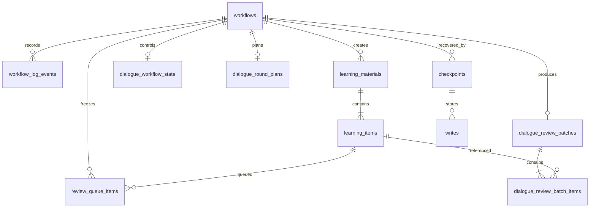

# Dada Study Review — SQLite Database Schema

| Item | Value |
| --- | --- |
| Type | Database design and field reference |
| Status | Implemented reference schema; live archive not included or verified in this public tree |
| Database | SQLite, one archive per configured deployment |
| Audience | Runtime maintainers, database maintainers, testers, architecture reviewers |
| Source of truth | `runtime/v3_workflow/persistence/schema.py`, `repository.py`, `migration.py`, workflow tests |
| Related design | [`docs/ARCHITECTURE.md`](ARCHITECTURE.md) |
| Last reviewed | 2026-09-07 |

## Summary

Dada stores business facts for Entry, Review, and Dialogue in one SQLite archive. The
current implementation defines nine business tables. The pinned LangGraph SQLite
checkpointer adds the infrastructure tables `checkpoints` and `writes`; those tables
are library-managed and are not Dada business facts.

The public repository intentionally contains neither a learning archive nor a SQLite
database file. This document describes the executable schema in the runtime DDL. A
deployment must inspect its configured archive separately before migration or repair;
this document must not be treated as a file-level inspection report.

The durable-facts model is:

```text
workflow_log_events (immutable history)
        + current control snapshots
        -> repository derives safe current state
        -> LangGraph checkpoint stores recovery control data
```

The program owns state transitions, authorization boundaries, transactions, queue
ordering, scheduling and persistence. Versioned state-machine contracts provide
English review, question wording and answer assessment. The database does not score
English by comparing `reference_text` with a child answer.

## Scope and storage rules

- The configured archive file is named `workflow-v3.sqlite3` and lives under the
  deployment's controlled archive root.
- After installing dependencies, initialize a new archive with
  `./scripts/initialize-database.py`. The default path is
  `<workspace archive>/workflow-v3.sqlite3`; use `--database PATH` for an explicit
  path. The command creates or verifies all nine business tables and the two pinned
  LangGraph checkpoint tables, then checks SQLite integrity and foreign keys.
- Entry, Review, and Dialogue share the same SQLite file and are isolated by the
  exact `external_session_id` supplied by the authorized host.
- There is no database `child` table. Identity and authorization come from a static
  host mapping, never from a nickname, self-assertion, or token length.
- Business writes use short transactions. Critical transitions use `BEGIN IMMEDIATE`
  and commit state facts, events, and visible replies together.
- The repository exposes fixed domain actions, not generic SQL update or delete
  helpers. History and completed records are retained.
- JSON columns are UTF-8 `TEXT` validated by SQLite with `json_valid()`. Contract
  validators own the meaning of the JSON document.
- Timestamps are normalized RFC 3339 UTC text. SQLite booleans are `INTEGER` values
  restricted to `0` and `1`.
- API keys, cookies, authorization headers, passwords, provider session tokens, and
  provider secrets must never be stored in the archive, checkpoints, logs, or
  fixtures. `external_session_id` is different: it is the host-authorized logical
  isolation key and is intentionally stored in `workflows`.

## Entity relationship diagram



The `checkpoints` and `writes` relationships are logical runtime relationships only:
the LangGraph checkpointer uses the workflow ID as its thread ID, but the library
tables do not carry Dada foreign keys to `workflows`.

## Business tables

### `workflows`

One row is an Entry, Review, or Dialogue workflow instance. Review keeps the current
item on this row while the complete frozen queue lives in `review_queue_items`.

```sql
CREATE TABLE IF NOT EXISTS workflows (
  workflow_id TEXT PRIMARY KEY,
  external_session_id TEXT NOT NULL,
  workflow_type TEXT NOT NULL CHECK (workflow_type IN ('entry', 'review', 'dialogue')),
  phase TEXT NOT NULL CHECK (phase IN ('active', 'paused_for_entry', 'closed')),
  learning_item_id TEXT REFERENCES learning_items(learning_item_id),
  question_sequence INTEGER NOT NULL DEFAULT 0 CHECK (question_sequence >= 0),
  locked_question_mode TEXT,
  locked_question_json TEXT CHECK (locked_question_json IS NULL OR json_valid(locked_question_json)),
  locked_item_revision INTEGER CHECK (locked_item_revision IS NULL OR locked_item_revision > 0),
  locked_at TEXT,
  started_at TEXT NOT NULL,
  paused_at TEXT,
  closed_at TEXT,
  CHECK ((workflow_type IN ('entry', 'dialogue') AND learning_item_id IS NULL)
         OR (workflow_type = 'review' AND learning_item_id IS NOT NULL)),
  CHECK (workflow_type = 'review' OR
         (question_sequence = 0 AND locked_question_mode IS NULL
          AND locked_question_json IS NULL AND locked_item_revision IS NULL
          AND locked_at IS NULL)),
  CHECK ((locked_question_mode IS NULL AND locked_question_json IS NULL
          AND locked_item_revision IS NULL AND locked_at IS NULL)
         OR (locked_question_mode IS NOT NULL AND locked_question_json IS NOT NULL
             AND locked_item_revision IS NOT NULL AND locked_at IS NOT NULL)),
  CHECK (locked_question_mode IS NULL OR question_sequence > 0),
  CHECK ((phase = 'active' AND paused_at IS NULL AND closed_at IS NULL)
         OR (phase = 'paused_for_entry' AND workflow_type = 'review'
             AND paused_at IS NOT NULL AND closed_at IS NULL)
         OR (phase = 'closed' AND closed_at IS NOT NULL
             AND locked_question_mode IS NULL AND locked_question_json IS NULL
             AND locked_item_revision IS NULL AND locked_at IS NULL))
);
```

Important invariants:

- `one_active_workflow_per_session` permits at most one active workflow per session.
- `one_paused_review_per_session` permits at most one paused Review per session.
- Entry and Dialogue cannot carry a Review item or question lock.
- A closed workflow has no live question lock.

### `workflow_log_events`

An ordered, append-only event log for child messages, model turns, assistant replies,
state transitions, question locks, assessments, scheduling and Dialogue facts.

```sql
CREATE TABLE IF NOT EXISTS workflow_log_events (
  event_id TEXT PRIMARY KEY,
  workflow_id TEXT NOT NULL REFERENCES workflows(workflow_id),
  sequence_no INTEGER NOT NULL CHECK (sequence_no > 0),
  event_type TEXT NOT NULL CHECK (event_type IN (
    'system_prompt', 'child_message', 'llm_request', 'internal_reasoning',
    'internal_reasoning_unavailable', 'tool_call', 'tool_result', 'llm_response',
    'model_turn_attempt_failed', 'assistant_response', 'state_transition',
    'reentry_requested', 'reentry_resolved', 'question_locked', 'question_released',
    'schedule_applied', 'material_archived', 'dialogue_turn_evaluated',
    'dialogue_capture_committed', 'dialogue_wrapping_started', 'dialogue_batch_ready',
    'unit_course_passed', 'dialogue_round_planned', 'dialogue_question_intent_used',
    'dialogue_progress_checkpoint', 'dialogue_round_completed',
    'dialogue_target_reopened'
  )),
  related_event_id TEXT REFERENCES workflow_log_events(event_id),
  payload_json TEXT NOT NULL CHECK (json_valid(payload_json)),
  created_at TEXT NOT NULL,
  UNIQUE (workflow_id, sequence_no),
  CHECK ((event_type = 'reentry_resolved' AND related_event_id IS NOT NULL)
         OR (event_type <> 'reentry_resolved' AND related_event_id IS NULL))
);
```

`related_event_id` is currently reserved for a `reentry_resolved` event. Repository
validation additionally requires the referenced event to belong to the same workflow
and to be an earlier re-entry request. Event payloads use `dada.workflow_log_event v1`;
the database validates JSON syntax while the runtime validates the contract.

### `learning_materials`

An Entry-audited material. A material may contain one or more independently
progressed learning items.

```sql
CREATE TABLE IF NOT EXISTS learning_materials (
  material_id TEXT PRIMARY KEY,
  source_workflow_id TEXT NOT NULL REFERENCES workflows(workflow_id),
  status TEXT NOT NULL CHECK (status IN ('draft', 'active', 'archived', 'superseded')),
  title TEXT NOT NULL,
  language TEXT NOT NULL CHECK (language = 'en'),
  unit_type TEXT NOT NULL CHECK (unit_type IN ('word', 'phrase', 'sentence')),
  reference_text TEXT NOT NULL,
  needs_parent_review INTEGER NOT NULL CHECK (needs_parent_review IN (0, 1)),
  audit_result_json TEXT NOT NULL CHECK (json_valid(audit_result_json)),
  created_at TEXT NOT NULL,
  updated_at TEXT NOT NULL
);
```

Only `active` material with `needs_parent_review = 0` can supply due items to Review.
Parent-required material stays `draft`; it is never placed in a Review queue.
Archival is a retained state change, not deletion.

### `learning_items`

The smallest independently scheduled Review unit.

```sql
CREATE TABLE IF NOT EXISTS learning_items (
  learning_item_id TEXT PRIMARY KEY,
  material_id TEXT NOT NULL REFERENCES learning_materials(material_id),
  item_order INTEGER NOT NULL CHECK (item_order > 0),
  reference_text TEXT NOT NULL,
  meaning_zh TEXT,
  review_context_json TEXT CHECK (review_context_json IS NULL OR json_valid(review_context_json)),
  review_stage INTEGER CHECK (review_stage >= 0),
  next_review_at TEXT,
  completed_at TEXT,
  revision INTEGER NOT NULL DEFAULT 1 CHECK (revision > 0),
  created_at TEXT NOT NULL,
  updated_at TEXT NOT NULL,
  UNIQUE (material_id, item_order),
  CHECK ((review_stage IS NULL AND next_review_at IS NULL AND completed_at IS NULL)
         OR (review_stage IS NOT NULL AND next_review_at IS NOT NULL AND completed_at IS NULL)
         OR (review_stage IS NOT NULL AND next_review_at IS NULL AND completed_at IS NOT NULL))
);
```

`review_context_json` is a nullable, versioned snapshot for phrase review. Legacy
items may remain null until an exact, safe backfill is available. `revision` is checked
when a question is assessed so a stale lock cannot mutate a changed item.

### `review_queue_items`

A frozen Review queue. The program, not the LLM, determines queue membership, order,
current item and advancement.

```sql
CREATE TABLE IF NOT EXISTS review_queue_items (
  workflow_id TEXT NOT NULL REFERENCES workflows(workflow_id),
  queue_position INTEGER NOT NULL CHECK (queue_position > 0),
  learning_item_id TEXT NOT NULL REFERENCES learning_items(learning_item_id),
  item_revision_at_start INTEGER NOT NULL CHECK (item_revision_at_start > 0),
  status TEXT NOT NULL CHECK (status IN ('pending', 'locked', 'completed')),
  completed_at TEXT,
  PRIMARY KEY (workflow_id, queue_position),
  UNIQUE (workflow_id, learning_item_id),
  CHECK ((status = 'completed' AND completed_at IS NOT NULL)
         OR (status <> 'completed' AND completed_at IS NULL))
);
```

An unanswered locked item remains locked or is retained as unfinished when the child
exits. It is not marked wrong, rescheduled, skipped, or silently removed.

### `dialogue_workflow_state`

The mutable control snapshot for an active Dialogue workflow. Unit version and hash
freeze the package used by that workflow; they do not create a new mastery namespace.

```sql
CREATE TABLE IF NOT EXISTS dialogue_workflow_state (
  workflow_id TEXT PRIMARY KEY REFERENCES workflows(workflow_id),
  unit_id TEXT NOT NULL,
  unit_version INTEGER NOT NULL CHECK (unit_version > 0),
  unit_content_hash TEXT NOT NULL,
  current_scenario_id TEXT NOT NULL,
  current_target_id TEXT NOT NULL,
  current_difficulty_level INTEGER NOT NULL CHECK (current_difficulty_level BETWEEN 0 AND 4),
  pending_repetition_target_id TEXT,
  captured_count INTEGER NOT NULL DEFAULT 0 CHECK (captured_count >= 0),
  subphase TEXT NOT NULL CHECK (subphase IN ('normal', 'wrapping_up'))
);
```

Dialogue target mastery is derived from immutable Dialogue events using stable
`target_id` values across Unit package versions. An explicit administrator reopen
action creates a new auditable cycle without rewriting history.

### `dialogue_round_plans`

A frozen plan for one Dialogue round and its recovery cursor.

```sql
CREATE TABLE IF NOT EXISTS dialogue_round_plans (
  workflow_id TEXT PRIMARY KEY REFERENCES workflows(workflow_id),
  plan_id TEXT NOT NULL UNIQUE,
  plan_json TEXT NOT NULL CHECK (json_valid(plan_json)),
  current_step_index INTEGER NOT NULL DEFAULT 0 CHECK (current_step_index >= 0),
  content_turn_count INTEGER NOT NULL DEFAULT 0
    CHECK (content_turn_count >= 0 AND content_turn_count <= 12),
  status TEXT NOT NULL DEFAULT 'active'
    CHECK (status IN ('active', 'completed', 'closed_without_completion'))
);
```

### `dialogue_review_batches`

The one-to-one handoff record produced when a closed Dialogue round has captured
learning items. It is consumed by at most one later Review workflow.

```sql
CREATE TABLE IF NOT EXISTS dialogue_review_batches (
  batch_id TEXT PRIMARY KEY,
  source_dialogue_workflow_id TEXT NOT NULL UNIQUE REFERENCES workflows(workflow_id),
  created_at TEXT NOT NULL,
  consumed_by_review_workflow_id TEXT UNIQUE REFERENCES workflows(workflow_id),
  consumed_at TEXT,
  CHECK ((consumed_by_review_workflow_id IS NULL AND consumed_at IS NULL)
         OR (consumed_by_review_workflow_id IS NOT NULL AND consumed_at IS NOT NULL))
);
```

### `dialogue_review_batch_items`

The ordered item list belonging to a Dialogue review batch.

```sql
CREATE TABLE IF NOT EXISTS dialogue_review_batch_items (
  batch_id TEXT NOT NULL REFERENCES dialogue_review_batches(batch_id),
  queue_position INTEGER NOT NULL CHECK (queue_position > 0),
  learning_item_id TEXT NOT NULL REFERENCES learning_items(learning_item_id),
  PRIMARY KEY (batch_id, queue_position),
  UNIQUE (batch_id, learning_item_id)
);
```

No empty batch is created. The item revision is captured when the batch becomes an
actual Review queue in `review_queue_items.item_revision_at_start`.

## Checkpointer tables

The public package pins `langgraph-checkpoint-sqlite==3.1.1`. Its SQLite checkpointer
creates the following infrastructure tables and sets SQLite to WAL mode. These are
dependency-owned tables: a future dependency version may change them, so the pinned
version must be updated together with this reference.

| Table | Owner | Purpose |
| --- | --- | --- |
| Table | Columns | Owner and purpose |
| --- | --- | --- |
| `checkpoints` | `thread_id TEXT NOT NULL`, `checkpoint_ns TEXT NOT NULL DEFAULT ''`, `checkpoint_id TEXT NOT NULL`, `parent_checkpoint_id TEXT`, `type TEXT`, `checkpoint BLOB`, `metadata BLOB`; primary key `(thread_id, checkpoint_ns, checkpoint_id)` | LangGraph checkpointer; Graph state snapshots and recovery metadata |
| `writes` | `thread_id TEXT NOT NULL`, `checkpoint_ns TEXT NOT NULL DEFAULT ''`, `checkpoint_id TEXT NOT NULL`, `task_id TEXT NOT NULL`, `idx INTEGER NOT NULL`, `channel TEXT NOT NULL`, `type TEXT`, `value BLOB`; primary key `(thread_id, checkpoint_ns, checkpoint_id, task_id, idx)` | LangGraph checkpointer; channel writes associated with checkpoints |

Equivalent current DDL from `SqliteSaver.setup()` is:

```sql
PRAGMA journal_mode=WAL;

CREATE TABLE IF NOT EXISTS checkpoints (
  thread_id TEXT NOT NULL,
  checkpoint_ns TEXT NOT NULL DEFAULT '',
  checkpoint_id TEXT NOT NULL,
  parent_checkpoint_id TEXT,
  type TEXT,
  checkpoint BLOB,
  metadata BLOB,
  PRIMARY KEY (thread_id, checkpoint_ns, checkpoint_id)
);

CREATE TABLE IF NOT EXISTS writes (
  thread_id TEXT NOT NULL,
  checkpoint_ns TEXT NOT NULL DEFAULT '',
  checkpoint_id TEXT NOT NULL,
  task_id TEXT NOT NULL,
  idx INTEGER NOT NULL,
  channel TEXT NOT NULL,
  type TEXT,
  value BLOB,
  PRIMARY KEY (thread_id, checkpoint_ns, checkpoint_id, task_id, idx)
);
```

Their exact columns are dependency-owned and may vary by checkpointer version. Dada
does not declare, mutate, or use them as the source of business truth. The runtime
must keep secrets and unrestricted conversation data out of checkpoint state as well
as out of business tables.

## Indexes

The executable DDL creates the following indexes:

| Index | Definition | Access pattern / invariant |
| --- | --- | --- |
| `one_active_workflow_per_session` | unique partial on `workflows(external_session_id)` where `phase = 'active'` | Prevents overlapping active workflows |
| `one_paused_review_per_session` | unique partial on `workflows(external_session_id)` where `workflow_type = 'review'` and `phase = 'paused_for_entry'` | Prevents multiple paused Reviews |
| `workflows_by_session_phase` | `workflows(external_session_id, phase)` | Finds current and historical session workflows |
| `workflows_by_learning_item` | `workflows(learning_item_id, started_at)` for Review rows | Finds Review history and item occupancy |
| `workflow_log_events_by_workflow` | `workflow_log_events(workflow_id, sequence_no)` | Reads and appends ordered events |
| `workflow_learning_materials_by_status` | `learning_materials(status, created_at)` | Filters lifecycle state |
| `workflow_learning_items_due` | partial on `learning_items(next_review_at)` for incomplete scheduled items | Finds due Review items |
| `review_queue_items_by_workflow_status` | `review_queue_items(workflow_id, status, queue_position)` | Advances a frozen queue |
| `dialogue_workflow_state_by_unit` | `dialogue_workflow_state(unit_id, unit_version)` | Locates Dialogue control rows by package |
| `dialogue_review_batches_unconsumed` | partial on `dialogue_review_batches(created_at)` where unconsumed | Finds pending Dialogue batches |
| `dialogue_review_batch_items_by_batch` | `dialogue_review_batch_items(batch_id, queue_position)` | Reads batch order |

Foreign keys are enabled on repository connections with `PRAGMA foreign_keys = ON`.
The schema has no cascade-delete policy because the domain does not expose generic
deletion and must retain audit history.

## Relationships and transaction boundaries

### Entry

```text
create entry workflow
  -> child message and model-turn audit events
  -> atomically create material, items, re-entry facts, and visible reply
  -> close only after required material handling is complete
```

Correct items are committed independently of items requiring clarification. A
parent-review draft never blocks correct items from being active.

### Review

```text
query active due items
  -> freeze review_queue_items
  -> lock one question and visible reply
  -> assess only the current lock
  -> apply configured schedule and revision
  -> complete queue item or move to the next item
```

Question text, `assistant_response`, queue progress, and recovery checkpoint are
committed before delivery. If a checkpoint is missing after a committed lock, the
runtime resends the committed text; it does not call the model to generate a new
question.

### Dialogue

```text
create dialogue workflow and state
  -> freeze a round plan
  -> append evaluation and progress events per interaction
  -> create learning items for committed captures
  -> close the workflow and optionally create a non-empty Review batch
```

Dialogue does not use a separate target-progress table. Stable target identity and
mastery are represented by immutable events and repository aggregation.

## Scheduling and audit policy

`learning_items` stores the resulting stage, due time, completion time, and revision;
the policy definition lives in versioned configuration. A `schedule_applied` event
records the policy identifier/version, before/after stage, resulting due time and
source response event. Later configuration changes do not recalculate historical
schedules.

The current standard strategy advances one consolidation stage after a high-accuracy
assessment, sends medium results back to the configured short interval, and sends low
results to the shortest interval. The exact intervals and thresholds are configuration
facts, not SQLite enum values or hard-coded table semantics.

## Migration and rollback

Schema creation is performed by `initialize_schema()` in
`runtime/v3_workflow/persistence/schema.py`. It creates or completes the current
target schema and may convert an existing single-item Review snapshot into a one-item
queue. It does not silently convert a legacy archive during service startup.

Explicit migrations in `runtime/v3_workflow/persistence/migration.py` include:

- `migrate_entry_database()` — legacy Entry-only tables to unified workflow tables;
- `migrate_dialogue_schema()` — adds Dialogue workflow and event support;
- `migrate_dialogue_round_schema()` — adds round-plan event types and tables;
- `migrate_model_turn_event_schema()` — adds model-turn failure auditing;
- `migrate_phrase_review_context_schema()` — adds nullable phrase context;
- `migrate_dialogue_target_identity_schema()` — adds stable target/reopen support.

Migrations preflight the input, run in a transaction, preserve IDs/sequences/payloads,
and verify `PRAGMA foreign_key_check` and `PRAGMA integrity_check` before commit.
There is intentionally no destructive SQL “down” migration: rollback means stop,
retain the original archive, and restore the pre-migration copy if verification fails.
Never delete or rewrite an archive to imitate rollback, and never run a migration
against an unconfirmed path.

## Failure recovery

| Failure point | Required behavior |
| --- | --- |
| Before business commit | Do not send a success reply or leave partial material/queue facts |
| Model call failure after child event | Retry the saved child event once; do not append a duplicate answer |
| Model output rejected by contract | Preserve failure audit; keep the locked item and require a controlled retry |
| Checkpoint missing after committed lock | Rebuild from business facts and resend the exact committed text |
| Assessment commit failure | Record the terminal failure; never return a handled response with empty text |
| Child exits with unanswered lock | Preserve unfinished queue state; do not mark wrong, reschedule, or skip |

## Verification

The public tree does not include a real archive, so its schema verification must use
a temporary SQLite file. The following commands install the workspace, initialize a
new archive, and run the deterministic public suite:

```bash
./scripts/bootstrap-workspace.sh
./scripts/initialize-database.py
pnpm run test:offline
```

The following checks are the minimum evidence for the runtime schema:

```bash
python -m unittest discover -s tests -p 'test_*.py' -v
node --test tests/test_inbound_v3_workflow_hook.mjs
node --check runtime/inbound_v3_workflow_hook/index.mjs
```

For a selected deployment archive, inspect it read-only before maintenance:

```python
import sqlite3

connection = sqlite3.connect("<confirmed-archive-root>/workflow-v3.sqlite3")
for name, sql in connection.execute(
    "SELECT name, sql FROM sqlite_master "
    "WHERE type IN ('table', 'index') AND sql IS NOT NULL ORDER BY name"
):
    print(name, sql)
print(connection.execute("PRAGMA integrity_check").fetchone()[0])
print(connection.execute("PRAGMA foreign_key_check").fetchall())
connection.close()
```

Expected implementation evidence is nine Dada business tables, the dependency-owned
checkpointer tables after the initializer or when a graph has run, an `ok` integrity check, no foreign-key
violations, the two active-workflow uniqueness indexes, the current event-type
checks, and the `review_context_json` JSON check. This is a checklist for an actual
archive inspection, not a claim that the public repository contains one.

## Performance and integrity notes

- The primary access paths are indexed by session, workflow sequence, due time,
  queue status, and unconsumed batch state.
- The event log is append-only and ordered per workflow. Do not replace it with a
  mutable aggregate table without preserving replay and audit semantics.
- Current deployment is single-family and single-process SQLite. Read replicas,
  sharding, and partitioning are not part of the implemented contract.
- If event volume grows, first benchmark retention, read-only reporting and archive
  rotation against the recovery requirements; do not introduce a second archive root
  or break `external_session_id` isolation.
- JSON is used at contract boundaries, not as a substitute for relational keys,
  queue order, revisions, or lifecycle columns.
- Any new event type, state, policy stage, or relationship must update the DDL,
  repository contract, migration path, tests, and the owning runtime index before it
  is considered implemented.
