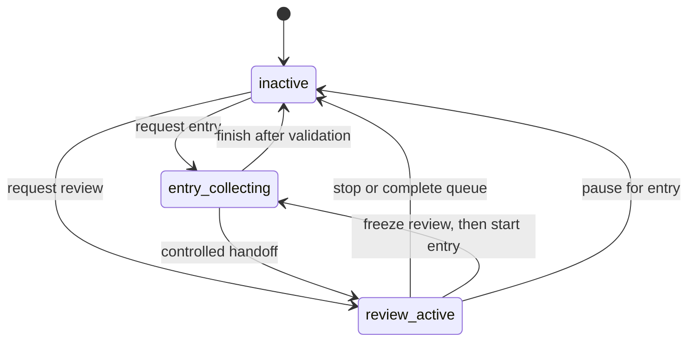

# Domain and state model

There are two active workflow states. Inactivity is the absence of an active workflow, not a third state.

| Stored fact | Visible activity | Allowed work |
| --- | --- | --- |
| active Entry workflow | `entry_collecting` | Record material, resolve re-entry, finish, or request review |
| active Review workflow | `review_active` | Answer a locked question, request guidance, stop, or request entry |
| no active workflow | inactive | Ordinary chat or an explicit request to start Entry or Review |
| paused Review for Entry | inactive | Entry work; Review resumes only after an explicit later request |

## Material lifecycle

| Status | Meaning | Review eligible |
| --- | --- | --- |
| `draft` | Needs an external approval action | No |
| `active` | Approved learning material | Yes, when its item is due |
| `archived` | Long-term retained completed material | No |
| `superseded` | Replaced by a controlled correction | No |

Starting Review freezes the complete due-item set into `review_queue_items`. New due items do not enter that round; the LLM cannot skip, choose, or reorder items. A valid assessment completes only the current item. Stopping before an answer leaves that item ungraded and unscheduled.

The default policy is versioned JSON: high accuracy advances one stage, partial accuracy returns to the short consolidation stage, and low accuracy returns to the initial stage. The supplied formal policy uses one hour, three hours, five days, and thirty days; archival happens only after the final successful review.
