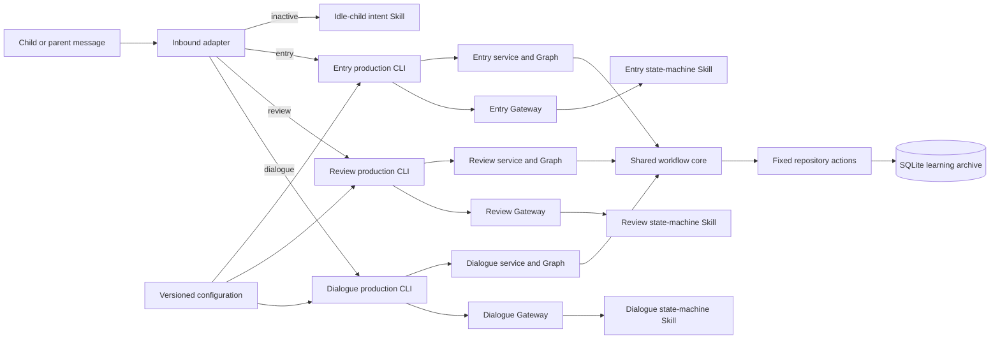

# Dada Study Review — Module Design

| Item | Value |
| --- | --- |
| Type | Module design and code reference |
| Status | Public reference implementation; live deployment requires deployment-owned configuration and validation |
| Audience | Maintainers, contributors, architecture reviewers, and testers |
| Sources of truth | `runtime/`, `skill/`, `config/`, `scripts/`, `tests/`, and the related public architecture/schema documents |
| Last reviewed | 2026-09-07 |

## Conclusion

Dada Study Review separates language decisions from durable workflow state. The runtime is organized into an inbound adapter, three workflow cores, a shared persistence and recovery core, production composition layers, Skills, configuration, and verification tools.

The most useful navigation rule is:

1. Start with `runtime/inbound_v3_workflow_hook/` to understand authorization and message routing.
2. Open the matching `runtime/v3_*_production/` package to see how a fixed Skill definition, model transport, and service are composed.
3. Enter `runtime/v3_entry/`, `runtime/v3_review/`, or `runtime/v3_dialogue/` for workflow behavior.
4. Enter `runtime/v3_workflow/` for database facts, repository actions, scheduling, recovery, model-turn retries, and TTS boundaries.
5. Check `skill/` and the relevant tests when changing model behavior or a contract.

## System map



An active message follows this path: static authorization → activity lookup → fixed production CLI → workflow Graph → repository transaction → successful checkpoint → visible delivery. Inactive messages may reach the idle-child intent Skill. Active messages do not pass through free chat.

## Module overview

| Module | Location | Owns | Does not own |
| --- | --- | --- | --- |
| Inbound adapter | `runtime/inbound_v3_workflow_hook/` | Static session checks, activity lookup, workflow routing, fixed start actions, and controlled outbound delivery | English judgment, arbitrary SQL, or dynamic identity inference |
| Shared workflow core | `runtime/v3_workflow/` | SQLite schema, immutable events, repository actions, scheduling, model-turn lifecycle, and TTS boundary | LangGraph orchestration, OpenClaw routing, or English semantics |
| Entry workflow | `runtime/v3_entry/` | Line-by-line entry, audit-result handling, re-entry tasks, and Entry→Review handoff | Identity authorization, provider transport, or direct sending |
| Review workflow | `runtime/v3_review/` | Due-item selection, frozen queues, question modes, locks, assessment, scheduling, and recovery | Automatic string-based grading, item selection by the LLM, or direct sending |
| Dialogue workflow | `runtime/v3_dialogue/` | Unit loading, round plans, conversation turns, target progress, and Review-batch capture | Textbook image access, pronunciation grading, or ordinary Review queue selection |
| Production composition | `runtime/v3_entry_production/`, `runtime/v3_review_production/`, `runtime/v3_dialogue_production/` | Definition/digest verification, fixed transports, configuration wiring, and JSON process boundaries | Business state transitions or generic model selection |
| Skills and course maintenance | `skill/` | Idle intent, state-machine behavior, textbook transcription, and Unit-candidate generation | SQLite, permissions, scheduling, or provider calls |
| Configuration | `config/` | Workspace paths, policies, schedules, and immutable Unit packages | Credentials, real archives, or dynamic configuration discovery |
| Verification | `scripts/`, `tests/`, `promptfoo/` | Publication checks, archive initialization, offline tests, replay, E2E, and model evaluation | Real household archives or live-channel acceptance |

## Shared workflow core

Entry, Review, and Dialogue use one business archive and one repository boundary. The shared package prevents each workflow from inventing its own persistence rules.

| File or directory | Function |
| --- | --- |
| `runtime/v3_workflow/persistence/schema.py` | Declares the Dada business tables, including `workflows`, `workflow_log_events`, `learning_materials`, `learning_items`, `review_queue_items`, and Dialogue tables. LangGraph checkpoint tables remain library-managed. |
| `runtime/v3_workflow/persistence/migration.py` | Implements explicit, no-loss schema migrations for legacy events, Dialogue, model-turn failures, phrase review context, and stable target identity. Startup initialization does not silently migrate an existing archive. |
| `runtime/v3_workflow/persistence/repository.py` | Implements `WorkflowRepository`, the fixed action boundary for workflow creation, events, materials, learning items, Review queues, Dialogue progress, batches, scheduling, handoffs, and administrator actions. It does not expose generic SQL mutation. |
| `runtime/v3_workflow/persistence/v1_active_import.py` | Imports controlled legacy active material only when explicitly invoked; it is not part of normal service startup. |
| `runtime/v3_workflow/policy/review_schedule.py` | Loads and interprets the versioned Review policy from `config/review-schedule.json`; policy stages and intervals are data, not hard-coded SQLite states. |
| `runtime/v3_workflow/review_context.py` | Validates bounded phrase Review context, information slots, target-form examples, and semantic alternatives without judging English. |
| `runtime/v3_workflow/model_turn/contracts.py` | Defines frozen model-turn, execution, commit, and outcome DTOs. |
| `runtime/v3_workflow/model_turn/pipeline.py` | Audits requests and responses, performs one model retry and one commit retry, and persists a terminal failure outcome. A commit retry never calls the model again. |
| `runtime/v3_workflow/tts/` | Provides the provider-neutral TTS boundary. It validates configuration, bounds text/audio, writes MP3 files atomically, and lets callers fall back to committed text. |

The core invariants are simple: events are ordered and immutable; writes use short transactions; a Review queue is frozen at start; a locked question and its visible reply are committed together; and checkpoints contain only recovery control data rather than full conversation content.

## Entry module

Entry converts one child-provided line at a time into audited learning material and learning items. The service accepts an already-authorized ingress and returns an in-memory delivery.

| File or directory | Function |
| --- | --- |
| `runtime/v3_entry/service.py` | `EntryTurnService` composes the repository, SQLite checkpointer, Graph, and injected Gateway. It handles existing-workflow and recovery checks. |
| `runtime/v3_entry/graph/build.py` | Builds the Entry Graph from route, process, close, and recovery nodes. |
| `runtime/v3_entry/graph/nodes.py` | Routes fixed start/collect/finish behavior, invokes the model-turn adapter, and handles recovery and handoff outcomes. |
| `runtime/v3_entry/graph/model_turn_adapter.py` | Connects Entry preparation, validation, and atomic business commit to `ModelTurnPipeline`. |
| `runtime/v3_entry/graph/state.py` | Separates ID-only persisted Graph state from call-local runtime context. Current messages and delivery buffers are not checkpoint data. |
| `runtime/v3_entry/contracts/entry_turn.py` | Defines Entry ingress, task, Gateway, and delivery DTOs. |
| `runtime/v3_entry/contracts/validation.py` | Validates Entry result and audit envelopes, versions, fields, and bounds; it does not decide English correctness. |
| `runtime/v3_entry/persistence/repository.py` | Preserves the Entry-facing repository API while delegating business facts to `WorkflowRepository`. |
| `runtime/v3_entry/gateway/port.py`, `fake.py` | Defines the credential-free Gateway port and deterministic fake used by offline tests. |

The normal order is: persist the child event → freeze and audit the model request → validate the structured result → commit material/items/re-entry/reply in a short transaction → checkpoint → return delivery. A correct material is not blocked by an unrelated re-entry task; unresolved re-entry blocks a Review handoff.

## Review module

Review processes the program-selected items in a frozen due queue. The program selects the item, question mode, lock, schedule, and queue position. The Review Skill supplies the question, semantic assessment, and child-facing feedback.

| File or directory | Function |
| --- | --- |
| `runtime/v3_review/service.py` | `ReviewTurnService` composes the shared repository, checkpointer, Review Graph, and Entry→Review handoff. |
| `runtime/v3_review/graph/build.py` | Builds the start, answer, next-question, and recovery routes. |
| `runtime/v3_review/graph/nodes.py` | Routes from workflow and lock facts, invokes the model adapter, and handles continuation, assessment, transitions, and recovery. |
| `runtime/v3_review/graph/model_turn_adapter.py` | Connects Review task/result validation and atomic actions to the shared model-turn pipeline. |
| `runtime/v3_review/graph/state.py` | Stores only workflow and event references in persisted Graph state; question text, answers, model output, and delivery stay in runtime context. |
| `runtime/v3_review/contracts/review_turn.py` | Defines authorized ingress, locked-question, assessment, and delivery DTOs. |
| `runtime/v3_review/contracts/validation.py` | Validates question, assessment, speech-text, selected-mode, and transition fields without interpreting English. |
| `runtime/v3_review/question_modes.py` | Selects a program-owned question mode from the fixed pool without generating a question. |
| `runtime/v3_review/handoff.py` | Performs controlled Entry→Review creation, queue freezing, and first-question locking. |
| `runtime/v3_review/gateway/port.py`, `fake.py` | Defines the credential-free Review Gateway and deterministic test fake. |

The normal order is: freeze all due items → select a mode → ask the Skill for a question → validate and lock the exact prompt → receive an answer → validate the assessment or transition → apply scheduling and advance the queue. An unanswered lock is not graded, scheduled, or skipped.

## Dialogue module

Dialogue runs textbook-constrained English conversation over an immutable Unit package. It records target progress and creates a dedicated Review batch when a completed round has captured learning items.

| File or directory | Function |
| --- | --- |
| `runtime/v3_dialogue/service.py` | `DialogueTurnService` composes the Unit, policy, repository, checkpointer, Graph, and injected Gateway. |
| `runtime/v3_dialogue/unit_definition.py` | Defines `UnitDefinition` and `DialoguePolicy`, and is the only loader/validator for Unit JSON and policy data. |
| `runtime/v3_dialogue/graph/build.py` | Builds start, continue, wrapping, and recovery routes. |
| `runtime/v3_dialogue/graph/selection.py` | Selects the program-owned round plan, target, scenario, difficulty, and L4 content slots. The model cannot reorder or invent targets. |
| `runtime/v3_dialogue/graph/nodes.py` | Routes turns, builds the frozen Dialogue task, invokes the shared pipeline, and commits progress/capture/close facts. |
| `runtime/v3_dialogue/graph/model_turn_adapter.py` | Connects Dialogue task/result validation and atomic commits to the shared model-turn lifecycle. |
| `runtime/v3_dialogue/graph/state.py` | Stores workflow and event references while keeping current text, Unit data, history, model output, and delivery in runtime context. |
| `runtime/v3_dialogue/presentation.py` | Renders program-owned child-visible state and progress text; the model does not invent counts or completion status. |
| `runtime/v3_dialogue/contracts/` | Defines and validates the Dialogue task/result contract, round plan, difficulty, question intent, capture candidates, and wrapping rules. |
| `runtime/v3_dialogue/gateway/port.py`, `fake.py` | Defines the credential-free Dialogue Gateway and deterministic test fake. |

Mastery is keyed by stable `target_id` across Unit package versions. `independent_success` completes a target for later-round exclusion; `supported_success` advances the current step but keeps the target retryable. Reopening a completed target requires an explicit audited administrator action.

## Production composition

Each workflow has a production composition package with the same responsibility split:

| File | Function |
| --- | --- |
| `runtime/v3_*_production/bundle.py` | Loads a fixed definition file set and verifies identity, safe contents, and the reviewed SHA-256 digest before a provider call. |
| `runtime/v3_*_production/gateway.py` | Converts a fixed task into a Responses or Chat Completions request, invokes an injected transport, and parses structured output. It does not expose arbitrary prompts, tools, or model selection. |
| `runtime/v3_*_production/service.py` | Composes the verified definition, Gateway, Unit/policy inputs, and offline workflow service. |
| `runtime/v3_*_production/cli.py` | Provides the fixed stdin/stdout JSON process boundary. Only this composition layer reads deployment variables and holds transport credentials. |

The production packages are composition roots, not business logic and not proof of live enablement. A live deployment still needs its own static mapping, definition digests, model configuration, protected credentials, Gateway, and channel checks.

## Inbound adapter

`runtime/inbound_v3_workflow_hook/index.mjs` is the host-specific OpenClaw adapter. Its main functions are:

| Function | Responsibility |
| --- | --- |
| `registerV3WorkflowInbound()` | Registers the plugin hook and fixed archive tool. |
| `isStaticDadaChildSession()` and `isStaticDadaInboundConversation()` | Enforce the configured session and conversation mapping. |
| `readV3WorkflowActivity()` | Performs the read-only activity lookup used for routing. |
| `requestEntryStart()`, `requestReviewStart()`, `requestDialogueStart()` | Expose the only fixed start adapters. Start payloads do not carry a topic, Unit, path, session, or model choice. |
| `handleV3WorkflowInbound()` | Routes active traffic to the matching production CLI and lets inactive traffic fall through to the idle-child Skill. |
| `idleDueReminderPrompt()` | Adds a due-item invitation only for an exact inactive child session with a positive fixed count. |
| `deliverReviewMedia()`, `deliverDialogueText()` | Deliver bounded optional media or text while preserving text fallback behavior. |

The adapter does not judge English, expose generic SQL/exec, infer identity from chat text, or start a workflow for inactive traffic.

## Skills, configuration, and verification

| Area | Main files | Function |
| --- | --- | --- |
| Idle intent | `skill/dada-english-recite-coach/` | Recognizes clear entry, review, and Dialogue starts and calls fixed actions; it does not handle active workflows. |
| Entry behavior | `skill/dada-entry-state-machine/` | Defines the JSON-only Entry task/result behavior for material audit, re-entry, and transition requests. |
| Review behavior | `skill/dada-review-state-machine/` | Defines question generation, semantic assessment, feedback, locked-question continuation, and transitions. |
| Dialogue behavior | `skill/dada-dialogue-state-machine/` | Defines controlled English turns, target evidence, difficulty suggestions, and wrapping behavior. |
| Course maintenance | `skill/dada-textbook-screenshot-to-markdown/`, `skill/dada-textbook-markdown-to-unit-candidate/` | Converts local textbook screenshots to page-split Markdown and then to validated Unit candidates without reading the runtime archive. |
| Versioned policy | `config/review-schedule.json`, `config/dialogue-policy.json`, `config/dialogue-units/` | Supplies Review scheduling, Dialogue policy, and immutable Unit packages. |
| Publication | `scripts/publish-skill.sh`, `scripts/definition_digest.py` | Publishes Skill mirrors and checks definition file sets/digests in the deployment workflow. |
| Archive setup/query | `scripts/initialize-database.py`, `scripts/query-v3-learning-archive.py` | Initializes a new archive or performs a bounded read-only query; neither imports private learning data. |
| Tests | `tests/entry_runtime/`, `tests/review_runtime/`, `tests/dialogue_runtime/`, `tests/workflow_runtime/`, `tests/*_production/` | Covers contracts, Graphs, repositories, gateways, scheduling, recovery, TTS, and production composition. |
| Host replay and CI | `tests/test_inbound_v3_workflow_hook.mjs`, `tests/test_review_openclaw_replay.mjs`, `.github/workflows/` | Covers routing and outbound seams without a real Gateway, channel, provider, or archive. |

## Model-turn and recovery boundaries

```text
Inbound adapter
  -> static authorization, activity lookup, fixed routing
Production CLI
  -> definition/digest, transport, and service composition
Workflow Graph
  -> route, validate, adapt, commit, checkpoint, recover
ModelTurnPipeline
  -> request/response audit, one model retry, one commit retry
Repository
  -> events, materials, locks, queues, schedules, and visible replies
```

The LLM result enters the repository only after local contract validation. A model or contract failure reuses the same frozen child event at most once. A commit retry reuses the validated result and does not call the model. If business facts were committed before a checkpoint failure, the recovery node replays those facts; Review re-sends the committed question instead of generating a replacement. TTS failure falls back to committed text and does not change learning state.

## Verification

For documentation-only changes, run:

```bash
git diff --check
pnpm run test:offline
```

Runtime or Skill changes require the complete relevant Python, Node, replay, definition, and public-tree checks described in `README.md` and `docs/ARCHITECTURE.md`. Offline success proves the reference implementation under temporary/synthetic data; it does not prove a live provider, Gateway, or channel deployment.

## Related documents

- [Architecture](ARCHITECTURE.md)
- [Database schema](DATABASE_SCHEMA.md)
- [Contributing](../CONTRIBUTING.md)
- [Security](../SECURITY.md)
